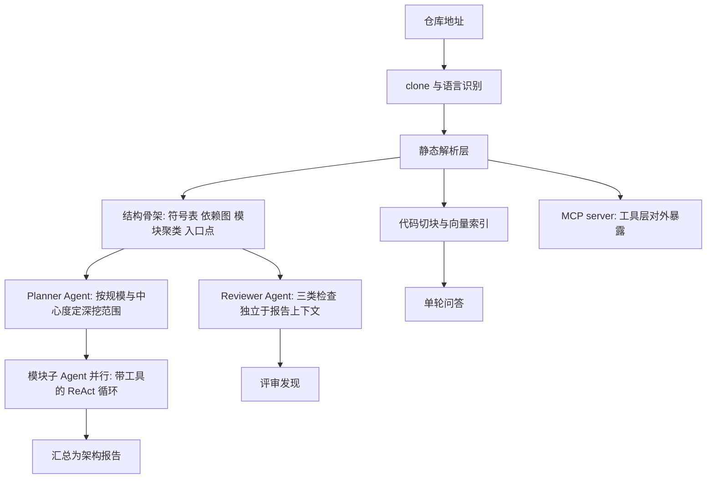
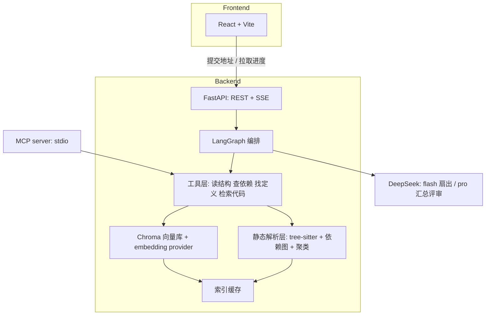
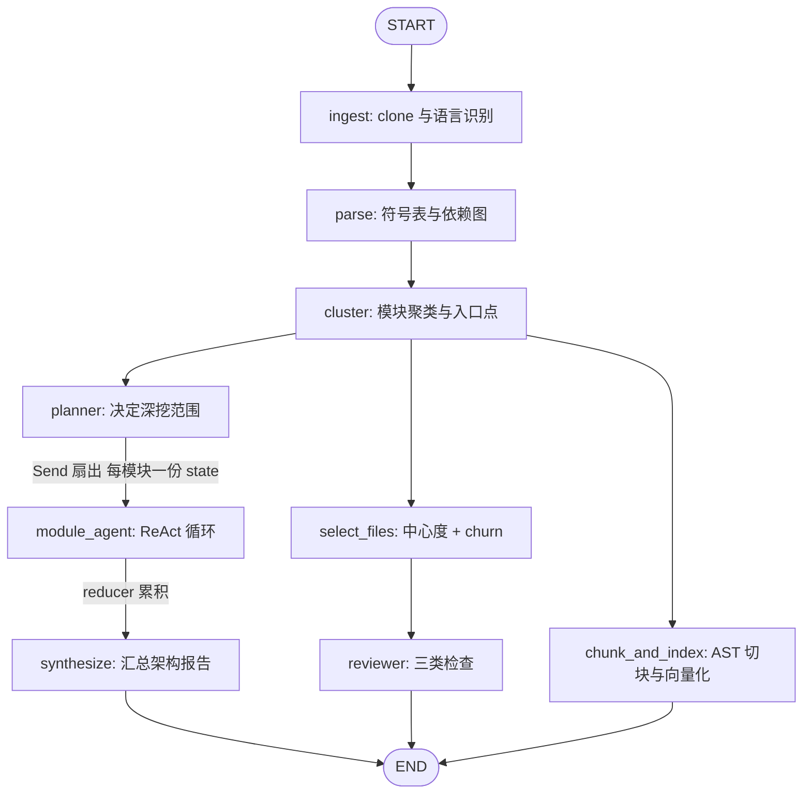
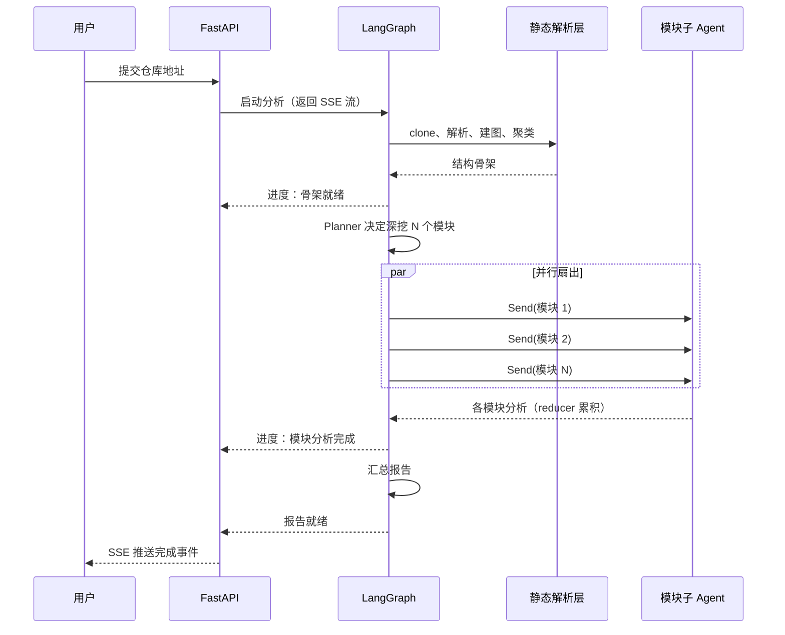

# CodePilot-Agent - Plan

## Goal Capsule

- **目标：** 构建一个多 Agent 代码分析系统：输入 GitHub 仓库地址，产出可追溯到具体文件的架构分析报告，并支持对该仓库的单轮代码问答和三类固定检查的代码评审。分析工具层以 MCP server 对外暴露。
- **产品权威：** 当前对话用户。所有产品语义决定由其确认。
- **成功的判定场域：** 技术面试。系统的每条链路都要能承受对实现细节的追问，这个标准高于功能数量。
- **推荐路径：** 静态解析层先产出确定骨架（不过 LLM），Planner 基于骨架决定深挖范围，模块子 Agent 经 LangGraph `Send` 扇出并行分析，最后汇总。RAG 只服务问答链路。工具层单一实现，同时供内部管道与 MCP server 使用。
- **决策焦点：** 模块聚类算法的准确度决定整份报告的骨架是否正确；Reviewer 的文件挑选策略决定评审发现是真问题还是泛泛之谈。这两处是全计划最影响产出质量的技术决定。
- **验证焦点：** 静态解析层与 Reviewer 检查写真实断言（输出确定）；Agent 生成的报告质量靠两个基准仓库实跑验证，不断言 LLM 输出。
- **最大风险：** 模块聚类做错会让报告骨架整体偏移，且这类错误在小仓库上看不出来，只在基准仓库实跑时暴露。缓解方式是 U4 先在两个基准仓库上人工核对聚类结果，再往下游推进。
- **停止条件：** 静态解析层（U3、U4）在两个基准仓库上产出的骨架未经人工核对前，不进入 Planner 与扇出实现。缓存 provider 标识（U9）未落地前，不切换 embedding provider。
- **执行画像：** 全部代码由 Agent 编写，用户事后通读学习。代码内需保留「这块解决什么问题、有哪几种做法、为什么选这个」的密度——它从实现前的指引改为实现后的讲解，作用不变。（2026-08-24 用户改变主意：原为「核心逻辑由用户编写」，见 Planning Contract 的执行方式偏离记录）
- **开放阻塞项：** 无。

---

## Product Contract

### Summary

输入 GitHub 仓库地址，系统在真实开源项目上产出三份内容：可追溯到具体文件路径的架构分析报告（主产出）、针对该仓库的单轮代码问答、以及结构/错误处理/安全三类检查的代码评审。仓库分析能力同时以 MCP server 形式对外暴露，可被 Claude Code、Cursor 等客户端直接调用。

### Problem Frame

理解一个陌生的中大型开源仓库目前靠人读：翻 README、看目录、追入口、猜分层。已有工具各解一片——DeepWiki 类产品生成浏览式 wiki，编码 Agent 能在会话内回答代码问题——但它们都不产出一份可交付、可追溯、能审阅的架构分析文档。

本项目的建设动机同时来自第二个方向：作为 Agent 开发岗位的能力证明。这个方向对系统提出了与功能无关的额外要求——多 Agent 分解必须有不可替代的理由，RAG 必须用在它真正适用的地方，报告的每个结论必须可核验。这些要求在 Key Decisions 中转化为具体约束。两个方向在「做扎实」上重合，在「做多」上冲突，冲突一律按前者裁决。

### Key Decisions

- **混合架构：静态骨架 + Agent 深挖。** 文件树、import 依赖图、模块聚类、入口点、技术栈识别由静态解析产出，不过 LLM；Planner 基于骨架决定深挖哪些模块；每个模块由带工具的 ReAct 子 Agent 读取并产出该模块分析；最后汇总成报告。确定的部分用确定手段，需要判断的部分才上 Agent。（session-settled: user-approved — 相对纯固定管道和纯 ReAct 自主探索：前者 Planner 无真实决策空间，后者在千文件仓库上容易迷路且成本失控）

- **RAG 只服务问答链路，报告链路走静态分析。** 架构问题（分几层、谁依赖谁、入口在哪）是图问题，靠 embedding 相似度问不出答案；向量检索适用于「找出与这个问题语义相关的代码」。把 RAG 塞进报告链路会引入检索到但无用的片段，质量低于直接使用结构化依赖图。（session-settled: user-approved — 相对原始设想的「RAG Agent 构建代码知识库供全链路使用」）

- **报告的每个结论必须可追溯到具体文件路径。** 「本项目采用分层架构、代码结构清晰」这类放到任何仓库都成立的表述不算结论。说「认证逻辑集中在这三处」就必须给出三个路径。这条约束是报告质量的硬底线，优先于报告的覆盖广度。

- **Reviewer 求准不求全：三类固定检查，每类有明确检测依据。** 结构类问题由依赖图算出，错误处理缺陷由 AST 定位候选点后交 LLM 判断，安全可疑模式按固定模式集匹配。宁可只报 5 条真问题，不要 50 条泛泛之谈。不做「让 LLM 自由发现问题」。（session-settled: user-directed — 三类检查从四个候选中选定，测试覆盖检查被排除）

- **问答降为单轮。** 检索、回答、给出引用文件与行号，不做会话记忆和 query 改写。省下的工时投入 Reviewer。会话状态管理在三条链路中技术含量最低。（session-settled: user-approved — 相对多轮对话式问答）

- **MCP 做成对外 server，而非内部管道的一层包装。** 仓库分析工具（读结构、查依赖、找定义、检索代码）按 MCP 协议暴露，任何 MCP 客户端可连接使用。内部包装只增加间接层，无功能收益。（session-settled: user-directed）

- **界面做成可用产品，不做 Agent 执行过程可视化。** 输入地址、看进度、读报告、追问。不把 LangGraph 图的执行状态、Agent 间消息、工具调用流做成界面展示内容。（session-settled: user-directed）

- **主力模型 DeepSeek；embedding 另配 provider。** DeepSeek 提供 chat completions、tool calls、context caching，不提供 embedding 接口，向量化需要独立 provider。（session-settled: user-directed — 相对 OpenAI/Anthropic 的成本与访问问题，以及本地小模型 tool calling 稳定性不足）

- **前端 React + Vite。** 用户已知这比 Streamlit 多花 12-15 小时、且前端不是目标岗位考察点，仍选择它以获得真实产品观感。（session-settled: user-directed — 相对 Streamlit/Gradio）

- **不削减范围；超时体现为工期延长。** 规划阶段不得通过砍功能来适配工时预算。（session-settled: user-directed）

- **核心逻辑由用户编写。** 每个模块先明确它解决什么问题、有哪几种做法、为什么选这个，然后由用户编写核心逻辑（Agent 节点、state 设计、切块策略、文件挑选策略等），脚手架与配置代码可由 Agent 生成。此项约束规划的产出形态：需要「原理 + 选型 + 待编写部分」的粒度，而非可直接套用的完整代码。（session-settled: user-directed — 相对全量生成后回头拆解）

- **语言范围限定 Python 与 TypeScript。** 静态解析层只需支持这两种语言的符号提取与 import 解析。TypeScript 的 import 解析（路径别名、相对导入、barrel 导出、`type` 导入）与 Python 差异显著，这是真实工程量而非重复劳动；两种语言共存也让解析层的抽象边界被真正检验，而非按单一语言写死。其他语言的文件计入文件树与规模统计，但不做符号级解析。（session-settled: user-directed — 相对只做 Python（无法兑现多语言）和 Python + Go/Java（工程量更大））

管道形状：

静态解析层同时供给四条下游：报告骨架、Reviewer 的检查依据、问答的索引来源、MCP 暴露的工具实现。Reviewer 不接收报告上下文，以保证其发现独立于报告叙述。

---

### Actors

- A1. **开发者** — 系统的名义使用者。输入仓库地址，读报告，追问，查看评审发现。
- A2. **Planner Agent** — 接收结构骨架，决定哪些模块进入深挖、深挖到什么程度。其分解职责源于上下文物理限制：千文件量级仓库约 200 万 token，超出单次调用可容纳范围。
- A3. **模块子 Agent** — 带工具的 ReAct 循环。读文件、追调用链、产出单个模块的分析。并行执行。
- A4. **Reviewer Agent** — 执行三类检查。运行在不含报告上下文的独立分支。
- A5. **RAG 检索层** — 服务问答链路的检索与回答。
- A6. **MCP 客户端** — Claude Code、Cursor 等外部工具，通过 MCP 协议调用本系统的仓库分析工具。
- A7. **静态解析层** — 非 LLM 组件。产出符号表、依赖图、模块聚类、入口点、技术栈识别结果。

---

### Key Flows

- F1. 首次分析一个仓库
  - **Trigger:** A1 提交 GitHub 仓库地址。
  - **Actors:** A1, A7, A2, A3
  - **Steps:** clone 仓库并识别语言构成 → A7 解析全仓库符号、构建 import 依赖图、聚类模块、识别入口点 → A2 基于骨架决定深挖范围 → A3 并行分析各模块 → 汇总为架构报告 → 索引落缓存。
  - **Outcome:** A1 获得一份每个结论可追溯到文件路径的架构报告。
  - **Covered by:** R1, R2, R3, R6, R7, R8, R9

- F2. 报告产出后追问
  - **Trigger:** A1 在已分析仓库的报告页提出代码问题。
  - **Actors:** A1, A5
  - **Steps:** 检索相关代码块 → 组装上下文 → 生成回答并附引用的文件路径与行号。
  - **Outcome:** A1 获得单轮回答，可核验引用来源。
  - **Covered by:** R12, R13, R14

- F3. 外部 MCP 客户端调用工具层
  - **Trigger:** A6 通过 MCP 协议连接本系统并调用某个工具。
  - **Actors:** A6, A7, A5
  - **Steps:** MCP server 接收调用 → 路由到对应工具实现（读结构、查依赖、找定义、检索代码）→ 返回结构化结果。
  - **Outcome:** A6 在自己的会话中获得该仓库的结构化信息，无需本系统的界面参与。
  - **Covered by:** R19, R20, R21

- F4. 重复分析同一仓库
  - **Trigger:** A1 提交一个已分析过的仓库地址。
  - **Actors:** A1, A7
  - **Steps:** 命中缓存 → 跳过解析与向量化 → 直接进入报告展示或按需重跑报告生成。
  - **Outcome:** 二次访问在秒级返回，不重复承担首次分析的分钟级延迟与 embedding 成本。
  - **Covered by:** R4, R5

- F5. 部分失败下的降级
  - **Trigger:** 分析过程中某个模块子 Agent 失败，或某个文件解析失败。
  - **Actors:** A2, A3
  - **Steps:** 记录失败范围 → 其余模块继续 → 报告中标注哪些部分缺失及原因。
  - **Outcome:** A1 获得一份标注了缺口的报告，而非整次运行失败。
  - **Covered by:** R10, R11

- F6. 代码评审
  - **Trigger:** 与 F1 同一次提交触发；A7 产出结构骨架后独立分支启动。
  - **Actors:** A4, A7
  - **Steps:** 依据骨架挑选待检文件 → 结构类检查由依赖图算出 → 错误处理缺陷由 AST 定位候选点后交 LLM 判断 → 安全可疑模式按固定模式集匹配 → 汇总发现与各类检查的执行范围。
  - **Outcome:** A1 获得带文件路径与行号的评审发现，以及各类检查的覆盖说明（含命中零条的类别）。
  - **Covered by:** R15, R16, R17, R18

---

### Requirements

**仓库接入与索引**

- R1. 接受公开 GitHub 仓库地址作为输入，拉取仓库并识别其语言构成。
- R2. 静态解析层产出结构骨架：文件树、符号表、import 依赖图、模块聚类、入口点、技术栈识别结果。符号级解析（符号提取、import 解析）覆盖 Python 与 TypeScript；其他语言的文件计入文件树与规模统计但不做符号级解析。此步骤不调用 LLM。
- R3. 系统在数百至千余文件的真实开源项目上完成完整分析，验收基准为一个 Python 仓库与一个前后端分离的 TypeScript 项目各一。
- R4. 首次分析的结果落缓存，二次提交同一仓库时命中缓存，不重复解析与向量化。
- R5. 缓存未命中时，界面在分析期间呈现进度，不出现无反馈的长时间等待。

**架构报告**

- R6. 报告包含模块划分、模块间依赖关系、入口点、关键流程、技术栈。
- R7. 报告中每个关于代码组织的结论都附带具体文件路径。无法落到路径的表述不进入报告。
- R8. Planner 基于结构骨架决定深挖范围，决策依据（模块规模、依赖中心度等）可在产出中体现。
- R9. 模块分析由并行的 ReAct 子 Agent 产出，每个子 Agent 具备读文件、查符号定义、查引用的工具。
- R10. 单个模块分析失败不导致整次运行失败；其余模块继续完成。
- R11. 报告标注缺失部分及其原因，包括解析失败的文件、跳过未深挖的模块及跳过原因、以及未做符号级解析的非 Python/TypeScript 范围。

**代码问答**

- R12. 支持针对已分析仓库提出代码问题并获得单轮回答。
- R13. 回答附带引用的文件路径与行号。
- R14. 检索不到相关代码时明确说明未找到，不基于无关片段生成回答。

**代码评审**

- R15. Reviewer 执行三类检查：结构类问题（循环依赖、跨层调用、超大模块、死代码）、错误处理缺陷（裸 except、异常被吞、IO 与网络调用缺错误处理、资源未关闭）、安全可疑模式（硬编码密钥、SQL 字符串拼接、不安全反序列化、命令拼接）。
- R16. 每条评审发现附带文件路径、行号、问题类型与判断依据。
- R17. 评审结果说明各类检查的执行范围与命中数量，包括命中零条的类别。命中零条与未执行检查在产出中可区分。
- R18. Reviewer 运行在不含架构报告内容的上下文中。

**MCP 工具层**

- R19. 仓库分析能力以 MCP server 形式对外暴露，工具集覆盖读取仓库结构、查询依赖关系、查找符号定义、检索代码。
- R20. MCP server 可被 Claude Code、Cursor 等标准 MCP 客户端连接并调用，无需本系统界面参与。
- R21. MCP 工具的实现与内部管道共用同一工具层，不维护两套逻辑。

**界面与交互**

- R22. 界面为可用产品形态：提交地址、查看分析进度、阅读报告、提出追问、查看评审发现。
- R23. 界面不承担 Agent 执行过程的可视化展示。
- R24. 前后端分离，后端能力通过 API 暴露。

**开发期可观测性**

- R25. Agent 执行链路具备 trace 或结构化日志，可定位 Planner 分解结果、各子 Agent 的工具调用与返回、state 传递内容。此项服务于开发调试，不进入界面。

---

### Acceptance Examples

- AE1. 超出预算规模的仓库
  - **Covers R3, R8, R11.**
  - **Given** 提交的仓库文件数量显著超出深挖预算。
  - **When** Planner 基于骨架决定深挖范围。
  - **Then** 系统完成分析而非拒绝或超时；报告覆盖被选中的模块，并标注哪些模块未深挖及跳过依据。

- AE2. 安全检查零命中
  - **Covers R17.**
  - **Given** 目标为成熟开源项目，其中已无明显安全可疑模式。
  - **When** Reviewer 完成安全类检查。
  - **Then** 产出说明已检查的模式集合与命中零条，而非留空。留空与零命中在产出中不得表现相同。

- AE3. 二次提交同一仓库
  - **Covers R4.**
  - **Given** 该仓库此前已完成分析且缓存有效。
  - **When** 再次提交同一地址。
  - **Then** 跳过解析与向量化，秒级返回，不重复产生 embedding 成本。

- AE4. 单模块分析失败
  - **Covers R10, R11.**
  - **Given** 某个模块子 Agent 在执行中失败。
  - **When** 该次分析继续推进。
  - **Then** 其余模块完成分析，报告产出并标注该模块缺失及原因。

- AE5. 问答检索不到相关代码
  - **Covers R14.**
  - **Given** 用户提出的问题在该仓库中无对应实现。
  - **When** 检索返回的结果与问题不相关。
  - **Then** 回答说明未在该仓库中找到相关代码，不基于无关片段编造答案。

- AE6. 仓库拉取失败
  - **Covers R1.**
  - **Given** 提交的地址不存在、为私有仓库或网络不可达。
  - **When** 拉取失败。
  - **Then** 界面给出可区分的失败原因，不呈现为分析中或空报告。

---

### Success Criteria

- 三条链路（报告、问答、评审）在两个基准仓库上均跑通，不依赖玩具仓库演示。
- 报告中不存在无法落到文件路径的通用性表述。抽查任意结论均可核验。
- 每个 Agent 的存在都能给出不可替代的理由，且该理由不是「为了展示多 Agent」。
- Reviewer 的发现是人类 reviewer 会指出的具体问题。以精确度为准，不以发现数量为准。
- MCP server 能被外部客户端实际连接并调用成功，而非仅协议实现完整。
- 用户能独立讲清每个模块的设计意图、备选做法与选择依据。

---

### Scope Boundaries

**Deferred for later**

- 增量索引与仓库更新后的重新分析。首次分析加缓存已满足当前需求。
- 多轮对话式问答（会话记忆、query 改写、追问澄清）。
- 测试覆盖类检查作为第四类评审检查。
- 私有仓库接入与鉴权。

**Outside this product's identity**

- Agent 执行过程的可视化展示。这是 Key Decisions 中界面定位那条的结果，不是工时妥协。
- 自动修复与 PR 生成。评审只产出发现，不改代码。
- 浏览式 wiki 形态的文档站点。产出是一份可交付的分析报告，不是可浏览的知识库网站。
- 多用户、账号体系、协作功能。

---

### Dependencies / Assumptions

- DeepSeek API 提供 chat completions、tool calls、context caching，**不提供 embedding 接口**。向量化需独立 provider（本地 bge-m3 或第三方 embedding 服务），该选型在规划阶段确定。
- 中型仓库单次完整分析的模型成本在数元量级，可承担反复测试。此假设基于 DeepSeek 定价，换 provider 后失效。
- tree-sitter 覆盖 Python 与 TypeScript 的解析需求，含 TSX 与 `.d.ts`。
- 首次分析存在分钟级延迟（clone + 解析 + 向量化），这是既定事实而非待优化项；缓存是对它的应对。
- 用户在四项核心技术（LangGraph、RAG、MCP、React）上均无动手经验。学习成本会被低估，实际工期预期为 1.5-2 个月业余投入。
- 目标场景为公开开源仓库。私有仓库、monorepo、非 Git 仓库不在假设范围内。

---

### Outstanding Questions

**Deferred to Planning**

- 基准仓库钉到具体项目。类别已定（一个 Python 仓库 + 一个前后端分离的 TypeScript 项目），但具体选哪两个需要 clone 后实测文件数与语言构成再定，不凭印象估。
- embedding provider 选型（本地 bge-m3 与第三方服务的成本、部署、检索质量权衡）。
- 代码切块粒度与切块边界策略（按函数、按类、按文件、AST 感知的混合）。
- 模块聚类算法（目录结构、import 图社区发现、两者结合）。
- Reviewer 的文件挑选信号与权重（git 变更频率、依赖中心度、入口可达性、Planner 反向指定）。
- 缓存键设计与失效策略。
- LangGraph state 结构与并行子 Agent 的结果汇聚方式。

---

### Sources / Research

- 已有产品形态调研（2026-08-23）：DeepWiki（Cognition）提供「替换 URL 域名即得可浏览 wiki + 对话」的形态，开源实现包括 deepwiki-open、RepoWiki、OpenDeepWiki。「LangGraph 多 Agent 代码分析」已进入 2026 年 LangGraph 项目点子清单与多家教程示例。**用途：** 支撑 Key Decisions 中「可追溯性作为质量底线」与 Scope Boundaries 中「不做浏览式 wiki」的定位决定——产出形态需与既有产品区分。**失效条件：** 这些产品的形态或可用性变化。
- DeepSeek API 能力核查（2026-08-23，来源 api-docs.deepseek.com）：提供 chat completions（OpenAI/Anthropic 兼容格式）、tool calls、JSON output、context caching、Files API、FIM completion；模型为 `deepseek-v4-flash`、`deepseek-v4-pro`、`deepseek-v4-flash-vision-exp`；推理能力通过 `thinking` 与 `reasoning_effort` 参数控制而非独立模型。**页面未列出 embedding 端点。** **用途：** 支撑 Dependencies 中的 embedding provider 需求与模型选型决定。**限制：** 定价与上下文窗口需另查 Models & Pricing 页面，本次未核。**失效条件：** DeepSeek 新增 embedding 接口，或模型列表变更。
- 本仓库状态（2026-08-23）：`git rev-parse HEAD` 报无提交，工作树仅含 `.claude/`、`.gitignore`、`CHANGELOG.md`、`CLAUDE.md`。无 `STRATEGY.md`、`CONCEPTS.md`、`README.md`、`docs/`。**用途：** 确认本项目从零起建，无既有代码约束、无既有项目术语需对齐。**失效条件：** 首次提交落地后此描述失效。

---

## Planning Contract

Product Contract unchanged (byte-preserved upstream source slice)

### Key Technical Decisions

- KTD1. **静态骨架路径不调用 LLM。** 文件树、符号表、import 依赖图、模块聚类、入口点、技术栈识别全部由代码产出。架构姿态 `new`：仓库为空，无既有能力可复用或扩展。这条决定让报告的每个结构性结论都有确定来源，也是 R7（结论可追溯到文件路径）能成立的前提——LLM 只负责解释骨架，不负责发现结构。
- KTD2. **模块扇出用 LangGraph 的 `Send` API。** 条件边的路由函数返回 `list[Send]`，每个 `Send` 携带单个模块的独立 state 分片；汇聚端用 `Annotated[list, operator.add]` reducer 累积各子 Agent 的结果。选它而非固定并行节点，因为深挖模块数在运行时才确定（取决于聚类结果和 Planner 判断），固定节点无法表达动态数量。
- KTD3. **模型分层：扇出用 `deepseek-v4-flash`，汇总与评审用 `deepseek-v4-pro`。** 扇出是高频低判断（读文件、总结模块），Pro 的输入成本是 Flash 的 3 倍而收益有限；汇总和评审是低频高判断，值得用 Pro。同一份结构骨架反复喂给多个子 Agent 时启用 context caching——命中价约为未命中的 1/30，这是扇出场景的主要省钱手段。代价：单模块分析深度略降。
- KTD4. **embedding 走 provider 抽象，缓存键包含 provider 标识与模型名。** 本地（`jina-code-embeddings` 或 `bge-m3`）与 API（千问 embedding）两条路均支持，由配置切换。缓存键必须含 provider 与模型标识：两家维度不同，切换后复用旧索引会静默污染检索结果且难以定位。
- KTD5. **向量库用 Chroma 本地持久化。** 无需独立服务进程，落盘即可复用，与 Docker Compose 的单容器部署兼容。pgvector 需要 Postgres、Milvus 需要额外容器，在本项目规模下是纯负担。
- KTD6. **代码切块按 AST 边界，不按固定字符数。** 用 tree-sitter 的语法树在函数与类边界切分，每块附带文件路径、起止行号、所属符号名。固定长度切分会把函数腰斩，检索命中半个函数体对回答代码问题几乎无用。
- KTD7. **MCP server 用 stdio 传输，作为本地进程运行在 Docker 之外，与内部管道共用同一工具层。** 编辑器客户端（Claude Code、Cursor）期望 spawn 本地可执行进程并走 stdio，容器化会挡住这条路。工具层单一实现，MCP server 与内部管道都是它的调用方，避免两套逻辑漂移。
- KTD8. **进度推送用 SSE。** 分析是分钟级单向进度流，SSE 比 WebSocket 简单（无需握手与双向状态管理），比轮询实时。FastAPI 原生支持。
- KTD9. **Reviewer 运行在不含报告内容的独立图分支。** 它只接收结构骨架与待检文件列表。若让它看到报告，其发现会被报告叙述锚定，倾向于确认报告已说过的内容而非独立发现问题。
- KTD10. **Reviewer 文件挑选用依赖图中心度 + 提交触碰频次。** 中心度高的文件被依赖多、出问题影响面大；被反复修改的文件通常是复杂度与债务的聚集地。两个信号都从已有数据算出（依赖图来自 U4，频次来自 `git log --name-only` 统计每个文件被多少个提交触碰），不需要额外 LLM 调用。用提交频次而非 `--numstat` 的行数增删：前者只需 tree 对象，后者需要历史 blob；而「哪些文件是债务聚集地」用变更频率就够，代码可维护性研究通常也用频率而非行数。不采用 Planner 按任务反向指定，因为那让挑选依据变成 LLM 判断，难以解释也难以复现。
- KTD11. **模块聚类结合目录结构与 import 图。** 目录结构是作者的显式意图，import 图是真实耦合关系。单靠目录会把 `utils/` 这类杂物袋当成模块；单靠 import 图社区发现会产出与作者心智模型不符的分组，报告读起来别扭。做法是以目录为初始分组，再用 import 图的跨组边密度合并或拆分。
- KTD12. **仓库拉取加硬性安全边界，克隆深度有界而非 1。** 有界浅克隆（`--depth N`，N 由配置决定）、不拉子模块、克隆前查仓库体积并设上限、克隆后不执行仓库内任何脚本或构建命令。深度不设 1 是因为 KTD10 的提交频次信号需要历史：实测 `--depth 1` 只有 1 个提交、churn 恒为空，而 `--depth 200` 在中型仓库上拿到上千个提交（depth 限制的是每条父链深度，合并提交产生多条链，总数远超 depth 值）、体积仅增约 2M、耗时仍在秒级；全量克隆在慢网络下会超时，演示场景不可用。系统接受任意用户输入的公开仓库地址，这是唯一的不可信输入面；tree-sitter 纯解析不执行代码，但一旦引入依赖安装或构建步骤，攻击面立刻打开。
- KTD13. **tree-sitter 用 `tree-sitter-language-pack` 预编译 wheel。** 避免在用户机器上编译 grammar。Python 与 TypeScript（含 TSX、`.d.ts`）均在覆盖范围内。
- KTD14. **路径解析统一走单一校验函数，不跟随符号链接。** 所有读文件路径（解析层、工具层、MCP 工具）先解析为真实路径再校验是否落在仓库工作目录内，落外即拒绝。克隆下来的仓库可以包含指向工作目录之外的符号链接——若解析层或读文件工具跟随它，仓库外的文件内容就可被读出。校验放在单一函数而非各调用点分别实现，避免漏一处即失效。
- KTD15. **MCP 边界复用同一路径校验，且不放宽。** MCP server 的工具面向外部客户端开放，其输入不可信程度高于内部管道。同一套校验必须在 MCP 边界生效——工具层单一实现（KTD7）已经让这一点成立，但需在 U14 单独断言，因为「内部调用已校验」不构成外部调用也已校验的证据。
- KTD16. **扇出宽度设上限。** 聚类可能产出数十个模块，无上限扇出会同时发起数十次 LLM 调用，成本与失败面同时放大。上限由配置决定，超出时 Planner 按优先级截断（U6 已有截断逻辑）。DeepSeek 的并发上限（flash 2500、pro 500）在本项目规模下不是约束，真正的约束是成本与单次分析的可控性。
- KTD17. **常见密钥文件不入向量索引。** `.env`、`*.pem`、`*.key` 等形态的文件排除在切块与向量化之外。索引是持久化落盘的，把密钥形态内容写进去会让问答链路有机会把它检索出来。这不与 Reviewer 的安全检查冲突——Reviewer 仍然扫描这些文件并报告硬编码密钥，它只是不把内容写进可检索的索引。

### High-Level Technical Design

组件拓扑。工具层是单一实现，被内部管道与 MCP server 共同调用：

LangGraph 节点图。三条链路共享静态骨架，Reviewer 分支不接收报告上下文：

首次分析的时序。Planner 与扇出之间是动态数量，`Send` 数取决于聚类与 Planner 判断：

### Interface Contracts

| Field | MCP server | 后端 API |
| --- | --- | --- |
| Interface / mode | `codepilot-mcp` · greenfield | `codepilot-api` · greenfield |
| Consumers | Claude Code、Cursor 等标准 MCP 客户端 | 本项目 React 前端 |
| Canonical artifact | `backend/mcp_server/server.py`（工具注册与 schema），owner U14 | `backend/api/routes.py` + 生成的 OpenAPI schema，owner U12 |
| Contract summary | stdio 传输；工具集为读仓库结构、查依赖关系、查找符号定义、检索代码；输入为仓库标识与查询参数，输出为结构化 JSON；未分析仓库返回明确错误而非空结果 | REST 提交分析与读结果，SSE 推送进度；错误区分仓库不存在、私有仓库、超规模、解析失败 |
| Compatibility | 首版，无既有消费者；工具名与参数一旦发布即视为对外契约，后续变更走新增可选参数 | 首版；前后端同仓库同步演进，无独立兼容窗口 |
| Verification | `mcp dev` 启动后用 MCP Inspector 核对工具 schema；U14 的测试断言工具返回结构 | FastAPI TestClient 断言状态码与响应结构；SSE 事件序列断言 |

### Assumptions

- 用户开发机可运行本地 embedding 模型或可访问 embedding API 之一。双 provider 抽象（U1）让任一条路可用即可推进，不阻塞。
- 基准仓库为公开可克隆状态，体积在设定上限内。具体仓库在 U2 完成后实测选定。
- DeepSeek 定价与 context caching 折扣按 2026-08-23 快照计算成本。定价变动会改变模型分层的性价比结论，但不改变分层结构本身。

### 执行方式偏离记录

2026-08-24，用户改变主意：**由「核心逻辑由用户编写」改为「Agent 写完整体功能，用户事后回头学习」。**

Product Contract 内的对应条目（标注 `session-settled: user-directed`）**已过期**。该区域为字节保留的上游切片，本 workflow 不改写它；如需同步，回 `spec-brainstorm` 更新该条决定。

这条改动不影响验收标准、范围边界或成功标准——它约束的是代码由谁写，不是造什么。因此按执行过程偏离记录，不作为产品变更返回 producer 阻塞实现。

**已知代价（用户已被告知并确认改变）：** 代码写完再回头读，比边写边理解慢，且失去「当时为什么这么选」的第一手记忆——那是面试追问里最难伪造的部分。缓解方式是代码内保留选型理由的密度：原本写给「实现前的你」的原理与备选方案说明，改为写给「读代码的你」，位置和内容不变。

Product Contract 的 Success Criteria 末项（用户能独立讲清每个模块的设计意图与选择依据）不因此放宽——它从实现过程的副产品变成需要主动通读达成的目标。

### Deferred Questions Resolution

Product Contract 的 `Deferred to Planning` 各项在本计划中的落点。该区域为只读上游切片，故收敛记录在此：

| Product Contract 遗留问题 | 落点 |
| --- | --- |
| 基准仓库钉到具体项目 | 仍为待定，落在 U2 完成后实测选定。类别已定（一个 Python 仓库 + 一个前后端分离的 TS 项目）。 |
| embedding provider 选型 | KTD4：双 provider 抽象，配置切换，缓存键含 provider 标识。 |
| 代码切块粒度与边界策略 | KTD6：按 AST 的函数与类边界切分；超长函数按语句边界二次切分。 |
| 模块聚类算法 | KTD11：目录结构为初始分组，再依 import 图跨组边密度合并或拆分。 |
| Reviewer 文件挑选信号与权重 | KTD10：依赖图中心度 + git 变更频率。权重在 U11 的基准仓库实跑中调参。 |
| 缓存键设计与失效策略 | KTD4 与 U9：键含仓库标识、commit SHA、provider identity、切块策略版本。 |
| LangGraph state 结构与并行结果汇聚 | KTD2 与 U5：`TypedDict` state，模块结果字段用 `Annotated[list, operator.add]` reducer。 |

### Implementation Scope Boundaries

以下项在实现范围外，与 Product Contract 的 Scope Boundaries 不重复：

- 单元测试不断言 LLM 生成内容的语义正确性。报告与模块分析的质量由基准仓库实跑人工核对，不写脆弱的输出断言。
- 不做 CI 流水线配置。Docker Compose 覆盖本地一键启动，CI 属于本项目范围外。
- 前端不做路由与多页面。单页应用，状态由组件内部管理，不引入状态管理库。
- 不做用户鉴权。系统为单用户本地运行；MCP server 与后端 API 均无鉴权层，这是有意的范围决定而非遗漏。

### Evidence & Limitations

- **LangGraph API**（来源 `docs.langchain.com/oss/python/langgraph/graph-api`，2026-08-23）：`langgraph` 包 1.x 线；`StateGraph` + `TypedDict` state；`Annotated[T, reducer]` 声明累积语义；`Send` 自 `langgraph.types` 导入，由条件边路由函数返回 `list[Send]` 实现动态扇出；checkpointer 在 `compile()` 时传入，checkpoint 写在 super-step 边界，**恢复时节点从函数头重跑，故节点副作用需幂等**。影响 KTD2 与 U5、U7。**限制：** 页面未固定确切最新版本，1.0.6 视为下限而非确认版本。
- **DeepSeek 定价**（来源 `api-docs.deepseek.com/quick_start/pricing`，2026-08-23）：`deepseek-v4-flash` 与 `deepseek-v4-pro` 均 1M 上下文、384K 最大输出；Pro 输入与输出单价约为 Flash 的 3 倍；cache 命中价约为未命中的 1/30；非高峰价为高峰价的一半。影响 KTD3。**限制：** 页面声明定价可变，此为快照。
- **embedding 选型**（外部调研，2026-08-23）：代码语料上代码专用 embedding 模型的检索质量明显优于通用模型。影响 KTD4 的本地模型选择。**限制：** 未在本项目基准仓库上实测对比，属于外部结论而非本地验证；U9 的验收包含一次实际检索质量抽查。
- **tree-sitter 与 MCP SDK 可用性**（外部调研，2026-08-23）：`tree-sitter-language-pack` 提供预编译 wheel 覆盖 Python 与 TypeScript；MCP Python SDK 含 FastMCP，支持 stdio 与 Streamable HTTP。影响 KTD13 与 KTD7。
- **本仓库为空**（`git rev-parse HEAD` 无提交，2026-08-23）：无既有代码、既有模式或项目术语约束，全部架构姿态为 `new`。这也意味着计划中的所有文件路径都是新建路径，无既有文件可参照。

### System-Wide Impact

- **后端服务面** `in-scope`：新建 FastAPI 应用，含分析编排、SSE 进度、结果读取。
- **前端客户端面** `in-scope`：新建 React + Vite 单页应用。
- **对外接口契约面** `in-scope`：MCP server 工具契约与后端 REST/SSE 契约，见 Interface Contracts。
- **数据面** `in-scope`：Chroma 向量库与索引缓存落盘。无关系数据库，无迁移。
- **运维部署面** `in-scope`：Docker Compose 覆盖后端与前端。MCP server 按 KTD7 在容器外运行。
- **安全面** `in-scope`：不可信仓库输入的克隆边界（KTD12）、统一路径校验与符号链接处理（KTD14）、MCP 边界的同等校验（KTD15）、密钥文件不入索引（KTD17）。API key 经环境变量注入，不入代码库与镜像。MCP server 与后端 API 均无鉴权层——单用户本地运行的有意决定，见 Implementation Scope Boundaries；这意味着 MCP server 的工具面只应在用户自己的机器上暴露，不可绑到对外网络接口。
- **验证测试面** `in-scope`：静态解析层与 Reviewer 检查写断言；Agent 输出经基准仓库实跑核对。
- **Agent/工具面** `in-scope`：工具层同时服务内部管道与 MCP 客户端。

### Risks & Dependencies

- **模块聚类偏移导致报告骨架整体错误。** 这是全计划最大的质量风险，且在小仓库上不暴露。缓解：U4 的验收要求在两个基准仓库上人工核对聚类结果，确认分组与作者意图基本吻合后才推进 U6。
- **子 Agent 恢复重跑导致重复副作用。** LangGraph checkpoint 写在 super-step 边界，恢复时节点从函数头重跑。若模块子 Agent 在节点内做了写文件或写缓存的副作用，恢复会重复执行。缓解：子 Agent 节点只返回数据，落盘副作用集中在汇聚节点。
- **不可信仓库输入。** 见 KTD12、KTD14、KTD15。残余风险有三处：超大文件或畸形语法可能让 tree-sitter 解析耗时异常，缓解是单文件解析设超时与体积上限，超限记为未解析并在报告标注；病态 import 结构（深层嵌套或密集环）可能让依赖图构建或聚类的内存与耗时失控，缓解是图构建设节点数上限与遍历深度上限，超限降级为目录级分组并标注；符号链接逃逸由 KTD14 的统一路径校验覆盖，MCP 边界由 KTD15 单独断言。
- **embedding provider 切换污染缓存。** 见 KTD4。缓存键含 provider 与模型标识，切换后自动视为未命中重建。
- **DeepSeek 定价或 API 变动。** 定价快照见 Evidence。API 为 OpenAI 兼容格式，provider 切换成本低，但 context caching 的行为是 DeepSeek 特有的，换 provider 后 KTD3 的成本结论失效。
- **首次分析延迟与面试现场演示冲突。** 首次分析分钟级（本地 CPU embedding 可能到十几分钟）。缓解：演示前预热基准仓库缓存，U9 的验收包含二次访问秒级返回。

### Planning Sources

- LangGraph Graph API 文档（`docs.langchain.com/oss/python/langgraph/graph-api`，2026-08-23）：`StateGraph`、reducer、`Send`、checkpointer 的当前导入路径与语义。支撑 KTD2、U5、U7。
- DeepSeek API 文档与定价页（`api-docs.deepseek.com`，2026-08-23）：模型列表、tool calls、context caching、无 embedding 端点、分层定价。支撑 KTD3、KTD4。
- `tree-sitter-language-pack`（PyPI）与 `py-tree-sitter` 文档：预编译 wheel 覆盖范围与 ABI 兼容性说明。支撑 KTD13、U3。
- MCP Python SDK / FastMCP 资料：stdio 与 Streamable HTTP 传输、工具注册、`mcp dev` 调试。支撑 KTD7、U14。
- 代码 embedding 选型调研（2026-08-23）：代码专用模型在代码检索上优于通用模型。支撑 KTD4、U9。

---

## Implementation Units

按 Goal Capsule 的执行画像，全部代码由 Agent 编写。各单元的 **核心逻辑** 字段标出该单元最影响产出质量、也最可能被面试追问的部分——这些位置的代码要带上选型理由，供用户事后通读。

### Unit Index

| U-ID | 单元 | 主要文件 | 依赖 |
| --- | --- | --- | --- |
| U1 | 项目骨架与 provider 抽象 | `backend/config.py`、`backend/providers/` | — |
| U2 | 仓库拉取与安全边界 | `backend/ingest/` | U1 |
| U3 | tree-sitter 解析层 | `backend/static_analysis/parser.py` | U1 |
| U4 | 依赖图与模块聚类 | `backend/static_analysis/graph.py`、`cluster.py` | U3 |
| U5 | LangGraph state 与图骨架 | `backend/graph/state.py`、`builder.py` | U1, U4 |
| U6 | Planner Agent | `backend/graph/nodes/planner.py` | U5 |
| U7 | 模块子 Agent 扇出 | `backend/graph/nodes/module_agent.py`、`backend/tools/` | U5, U6 |
| U8 | 报告汇总 | `backend/graph/nodes/synthesize.py`、`backend/report/` | U7 |
| U9 | 代码切块、向量索引与缓存 | `backend/rag/`、`backend/cache/` | U3 |
| U10 | 单轮代码问答 | `backend/rag/qa.py` | U9 |
| U11 | Reviewer 三类检查 | `backend/graph/nodes/reviewer.py`、`backend/review/` | U4, U5 |
| U12 | FastAPI 后端与 SSE | `backend/api/` | U5, U8, U11 |
| U13 | React 前端 | `frontend/src/` | U12 |
| U14 | MCP server | `backend/mcp_server/` | U7, U9 |
| U15 | Docker Compose | `docker-compose.yml`、`backend/Dockerfile`、`frontend/Dockerfile` | U12, U13 |

### U1. 项目骨架与 provider 抽象

- **Goal** 建立后端与前端目录结构、配置加载、LLM 与 embedding 的 provider 抽象层。
- **Requirements** 支撑全部单元；直接服务 R2、R3 的多 provider 前提。
- **Dependencies** 无。
- **Files** `backend/config.py`、`backend/providers/llm.py`、`backend/providers/embedding.py`、`backend/providers/__init__.py`、`backend/paths.py`、`frontend/package.json`、`frontend/vite.config.ts`、`.env.example`、`pyproject.toml`、`tests/test_providers.py`、`tests/test_paths.py`
- **Approach** 配置从环境变量加载，不硬编码 key。LLM provider 封装 DeepSeek 的 OpenAI 兼容端点，暴露 flash 与 pro 两档（KTD3）。embedding provider 定义统一接口（`embed_texts`、`dimension`、`identity`），本地与 API 两种实现（KTD4）。`identity` 返回 provider 名加模型名，供 U9 的缓存键使用。
- **核心逻辑** provider 接口的方法签名与 `identity` 的构成规则由用户设计——这决定了缓存键的稳定性。
- **Patterns to follow** 仓库为空，无既有模式可参照，故本单元建立后续单元遵循的约定：provider 抽象保持薄（只做调用转发与配置解析，不含业务逻辑）；配置对象在应用启动时构造一次并注入，不在各模块内重复读环境变量；`identity` 由 provider 名与模型名拼成且格式固定，因为它进入 U9 的缓存键，格式变动等于全量缓存失效。路径校验函数（KTD14）也在本单元建立，供 U2、U3、U7、U14 共用。
- **Test scenarios**
  - 配置缺少必需环境变量时，加载抛出明确错误并指出缺哪一项。
  - 本地与 API 两个 embedding provider 的 `identity` 返回值不同，且同一 provider 的 `identity` 跨进程稳定。
  - `dimension` 与实际 `embed_texts` 返回的向量维度一致。
  - LLM provider 按档位返回对应模型标识（flash 档返回 flash 模型名）。
  - 路径校验函数对工作目录内的普通路径放行。
  - 路径校验函数对含 `../` 且解析后落在工作目录外的路径拒绝。
  - 路径校验函数对指向工作目录外的符号链接拒绝（构造一个真实符号链接测试，不是仅测字符串）。
  - 路径校验函数对指向工作目录内的符号链接的处理与实现选择一致（放行或统一拒绝，二者择一但需一致）。
- **Verification** 两个 embedding provider 各自能对一小段文本返回维度正确的向量；LLM provider 能完成一次最小 chat 调用；路径校验函数的符号链接测试通过。

### U2. 仓库拉取与安全边界

- **Goal** 从 GitHub 地址拉取仓库到本地工作目录，识别语言构成，实施 KTD12 的全部安全边界。
- **Requirements** R1；AE6（拉取失败可区分原因）。
- **Dependencies** U1
- **Files** `backend/ingest/clone.py`、`backend/ingest/language_detect.py`、`backend/ingest/guards.py`、`tests/test_ingest.py`
- **Approach** 克隆前先查仓库体积与文件数（GitHub API），超上限直接拒绝并返回可区分错误。有界浅克隆 `--depth N`（KTD12）、不拉子模块。克隆后不执行仓库内任何脚本。语言构成按扩展名统计，产出各语言文件数与占比。工作目录路径校验复用 U1 的 `resolve_within`。
- **Execution note** 安全边界先写测试再实现——这些是拒绝路径，正向实现容易漏掉。
- **核心逻辑** 体积上限的具体阈值与超限后的降级策略（拒绝还是要求指定子目录）由用户决定；路径逃逸校验的实现由用户编写。
- **Test scenarios**
  - 合法公开仓库地址完成浅克隆，工作目录下存在文件树。
  - 不存在的仓库地址返回「仓库不存在」而非通用失败。
  - 私有仓库地址返回「无访问权限」而非「不存在」。
  - 超出体积上限的仓库在克隆前被拒绝，错误信息含实际体积与上限。
  - 含子模块的仓库克隆后子模块目录为空，未递归拉取。
  - 克隆后 `git rev-list --count HEAD` 大于 1，提交频次统计有可用历史（覆盖 KTD12 的有界深度决定）。
  - 构造含 `../` 路径的输入时，路径校验拒绝并不写出工作目录之外。
  - 克隆结果含指向工作目录外的符号链接时，后续读取被路径校验拒绝（覆盖 KTD14）。
  - 语言构成统计对混合语言仓库返回各语言文件数，占比之和为 1。
- **Verification** 两个候选基准仓库均能成功克隆并产出语言构成；三类失败路径各返回可区分错误。

### U3. tree-sitter 解析层

- **Goal** 对 Python 与 TypeScript 文件做符号级解析，产出符号表与每文件的 import 声明。
- **Requirements** R2（符号级解析覆盖 Python 与 TypeScript）；R11（未解析范围需标注）。
- **Dependencies** U1
- **Files** `backend/static_analysis/parser.py`、`backend/static_analysis/queries/python.scm`、`backend/static_analysis/queries/typescript.scm`、`backend/static_analysis/symbols.py`、`tests/test_parser.py`
- **Approach** 用 `tree-sitter-language-pack` 加载预编译 grammar（KTD13）。每种语言一组 tree-sitter query 提取函数、类、方法定义与 import 语句。符号记录名称、类型、文件路径、起止行号。非 Python/TypeScript 文件只计入文件树，标记为未解析。单文件解析设超时与体积上限，超限记为未解析并附原因。
- **核心逻辑** tree-sitter query 的编写（`.scm` 文件）是本单元的核心——决定能提取到哪些符号。TypeScript 的 import 形态（默认导入、命名导入、`type` 导入、`export from` 再导出）比 Python 复杂，需要用户逐一处理。
- **Test scenarios**
  - Python 文件的函数、类、方法定义被提取，行号与源文件一致。
  - Python 的 `import x`、`from x import y`、`from . import z` 三种形态均被识别，相对导入的层级被正确记录。
  - TypeScript 的默认导入、命名导入、`import type`、`export ... from` 均被识别。
  - TSX 文件能解析，组件定义被识别为符号。
  - `.d.ts` 文件能解析且不因缺少实现体而报错。
  - 语法错误的文件不导致整次解析中断，该文件被标记为解析失败并附原因。
  - 超过单文件体积上限的文件被标记为未解析，不尝试解析。
  - 非 Python/TypeScript 文件（如 `.md`、`.json`）计入文件树但不进入符号表。
- **Verification** 在两个基准仓库上解析完成，符号表非空，未解析文件列表与实际语言构成吻合。

### U4. 依赖图与模块聚类

- **Goal** 由 import 声明构建文件级依赖图，聚类出模块边界，识别入口点。
- **Requirements** R2（依赖图、模块聚类、入口点）；R6（报告需含模块划分与依赖关系）。
- **Dependencies** U3
- **Files** `backend/static_analysis/graph.py`、`backend/static_analysis/cluster.py`、`backend/static_analysis/entrypoints.py`、`tests/test_graph.py`、`tests/test_cluster.py`
- **Approach** import 声明解析为图的有向边，需处理相对导入到绝对路径的归一化、TypeScript 路径别名（读 `tsconfig.json` 的 `paths`）、barrel 再导出的传递。聚类按 KTD11：以目录为初始分组，再依据跨组边密度合并或拆分。入口点识别按语言约定（Python 的 `__main__`、`setup.py` 的 console_scripts；TypeScript 的 `package.json` 的 `main`/`bin`/`exports`）加图上的零入度节点。中心度用于 U11 的文件挑选。
- **核心逻辑** 聚类算法是本单元也是全计划最影响报告质量的部分（见 Goal Capsule 的决策焦点）。合并与拆分的判据、阈值选择由用户设计并在基准仓库上调参。
- **Test scenarios**
  - 构造小型文件集，import 关系正确转为有向边，无自环。
  - Python 相对导入 `from ..pkg import mod` 归一化为正确的绝对路径。
  - TypeScript 路径别名（`@/utils` 形态）依据 `tsconfig.json` 解析到实际文件。
  - barrel 再导出（`export * from './x'`）的传递依赖被记录。
  - 指向仓库外的 import（第三方包）不产生图内节点，被单独记为外部依赖。
  - 循环依赖存在时图构建不进入无限递归，环被记录。
  - 节点数超过上限时图构建降级为目录级分组并标注，不耗尽内存（覆盖 Risks 的病态结构项）。
  - 聚类对目录结构清晰的输入产出与目录一致的分组。
  - 聚类对跨目录高耦合的输入产出合并分组，而非机械照搬目录。
  - 入口点识别在有 `__main__` 的 Python 项目与有 `package.json` `main` 的 TS 项目上各自命中。
- **Verification** 两个基准仓库的聚类结果经人工核对，分组与作者意图基本吻合（Goal Capsule 的停止条件：此项未过不推进 U6）。中心度排序的 top 文件符合直觉。

### U5. LangGraph state 与图骨架

- **Goal** 定义 state schema 与图结构，接入 trace/日志，跑通一条不含 LLM 调用的空管道。
- **Requirements** 支撑 R8、R9、R10；直接服务 R25（开发期可观测性）。
- **Dependencies** U1, U4
- **Files** `backend/graph/state.py`、`backend/graph/builder.py`、`backend/graph/observability.py`、`tests/test_graph_skeleton.py`
- **Approach** state 用 `TypedDict`；模块分析结果字段用 `Annotated[list, operator.add]` reducer 以支持扇出汇聚（KTD2）。图结构按 High-Level Technical Design 的节点图连边。checkpointer 先用内存实现。trace 接 LangSmith（环境变量开关）或结构化日志兜底，记录每节点的输入输出摘要与耗时。
- **Execution note** 先用 stub 节点（返回固定数据、不调 LLM）跑通全图连通性与 reducer 累积，再逐个替换为真实节点。这样扇出机制的问题能在没有 LLM 噪声的情况下暴露。
- **核心逻辑** state 字段设计是本单元核心——哪些字段需要 reducer、哪些是覆盖语义、子 Agent 的 state 分片带什么，由用户设计。这是面试最可能追问的部分之一。
- **Patterns to follow** `Send` 用法见 Evidence 中的 LangGraph 文档条目。注意 checkpoint 恢复时节点从函数头重跑，故节点内不放非幂等副作用（见 Risks）。
- **Test scenarios**
  - stub 节点全图跑通，START 到 END 路径连通。
  - 扇出 3 个 stub 子任务，reducer 累积后结果数量为 3，不丢不重。
  - 扇出数量为 0 时图不卡死，汇聚节点收到空列表。
  - 单个 stub 子任务抛异常时其余任务仍完成，失败被记录（覆盖 R10 的机制基础）。
  - trace 开关关闭时图正常运行，不因缺少 LangSmith 配置报错。
  - state 中带 reducer 的字段在多次更新后累积，不带 reducer 的字段被覆盖。
- **Verification** 空管道端到端跑通；trace 中能看到每个节点的执行顺序与耗时。

### U6. Planner Agent

- **Goal** 基于结构骨架决定深挖哪些模块、深挖到什么程度，产出可解释的决策依据。
- **Requirements** R8（决策依据可在产出中体现）。
- **Dependencies** U5
- **Files** `backend/graph/nodes/planner.py`、`backend/graph/prompts/planner.py`、`tests/test_planner.py`
- **Approach** 输入为模块聚类结果加各模块的规模与中心度统计。Planner 输出结构化的深挖计划：模块列表、每个模块的优先级与理由、预估的分析预算。用 JSON 输出模式约束返回结构。扇出宽度上限由配置决定（KTD16），超出时按优先级截断。
- **核心逻辑** Planner 的 prompt 设计与输出 schema 由用户编写。关键判断是：让 LLM 决定优先级，还是用规则（中心度加规模）排序后只让 LLM 决定截断位置。后者更可解释也更省，建议先做后者。
- **Test scenarios**
  - 输入 5 个模块的骨架，输出的深挖列表为骨架中真实存在的模块，无幻觉模块名。
  - 模块数超出扇出上限时，输出列表被截断到上限内且保留高优先级项。
  - 输出的每个模块附带非空理由。
  - LLM 返回格式非法时节点重试一次，重试仍失败则降级为规则排序结果而非整次失败。
  - 骨架中模块数为 1 时输出合法（不因单元素退化）。
- **Verification** 在两个基准仓库上产出的深挖列表覆盖了人工判断的核心模块。

### U7. 模块子 Agent 扇出

- **Goal** 每个待深挖模块由一个带工具的 ReAct 子 Agent 分析，并行执行，结果汇聚。
- **Requirements** R9（子 Agent 具备读文件、查定义、查引用工具）；R10（单模块失败不影响整体）。
- **Dependencies** U5, U6
- **Files** `backend/graph/nodes/module_agent.py`、`backend/tools/read_file.py`、`backend/tools/find_definition.py`、`backend/tools/find_references.py`、`backend/tools/list_structure.py`、`backend/tools/__init__.py`、`tests/test_tools.py`、`tests/test_module_agent.py`
- **Approach** 条件边路由函数返回 `list[Send]`，每个 `Send` 携带单模块的 state 分片（KTD2）。子 Agent 用 flash 档模型（KTD3），工具集为读文件（支持行范围）、查符号定义、查引用、列目录结构。工具层实现独立于 Agent，同一份实现供 U14 的 MCP server 复用（KTD7）。ReAct 循环设最大轮次上限防打转。节点只返回数据，落盘副作用留给汇聚节点（见 Risks）。
- **核心逻辑** 工具的参数设计与返回格式、ReAct 循环的轮次上限与终止条件、子 Agent 的 prompt 由用户编写。工具返回内容的裁剪策略（读文件返回多少行、超长如何截断）直接影响成本与效果。
- **Test scenarios**
  - 读文件工具按行范围返回内容，越界范围返回可用结果而非异常。
  - 读文件工具对不存在路径返回明确错误，不返回空字符串。
  - 查定义工具对已知符号返回文件路径与行号，与 U3 的符号表一致。
  - 查引用工具对被多处引用的符号返回全部引用点。
  - 查定义工具对不存在符号返回空结果并明确说明未找到。
  - 列目录结构工具的输出不逃逸仓库工作目录。
  - 扇出 3 个模块，3 份分析结果经 reducer 汇聚，每份对应正确模块。
  - 单个子 Agent 超出轮次上限时该模块标记为部分完成，其余模块不受影响。
  - 单个子 Agent 抛异常时失败被记录，其余模块完成（覆盖 AE4）。
- **Verification** 基准仓库上并行分析完成，各模块分析引用的文件路径真实存在；trace 中能看到每个子 Agent 的工具调用序列。

### U8. 报告汇总

- **Goal** 将结构骨架与各模块分析汇总为架构报告，强制每个结论可追溯到文件路径。
- **Requirements** R6、R7（结论附文件路径）、R11（标注缺失部分）。
- **Dependencies** U7
- **Files** `backend/graph/nodes/synthesize.py`、`backend/graph/prompts/synthesize.py`、`backend/report/schema.py`、`backend/report/validate.py`、`tests/test_report_validate.py`
- **Approach** 用 pro 档模型（KTD3）。报告为结构化对象而非自由文本：模块划分、依赖关系、入口点、关键流程、技术栈各为独立字段，每个结论项带 `citations` 列表（文件路径加可选行号）。落盘前跑校验：`citations` 为空的结论项被拒绝或降级；引用的路径必须在文件树中真实存在。缺失部分（解析失败文件、未深挖模块、未做符号级解析的语言范围）单独成节。
- **核心逻辑** 报告 schema 设计与校验规则由用户编写。校验是 R7 从「要求」变成「保证」的关键——没有校验，可追溯性只是 prompt 里的期望。
- **Test scenarios**
  - 构造含无 citations 结论的报告对象，校验拒绝该项并给出原因。
  - 构造引用不存在路径的报告对象，校验识别为无效引用。
  - 引用真实存在路径的报告对象通过校验。
  - 引用中带行号且行号超出文件实际行数时校验识别为无效。
  - 缺失部分为空时该节仍存在且明确说明无缺失，不留空白（覆盖 R11 与 AE2 的表达一致性）。
  - 未深挖模块列表非空时报告标注其名称与跳过原因。
- **Verification** 两个基准仓库的报告经人工抽查，随机取 5 条结论均能在引用路径中找到支撑证据。

### U9. 代码切块、向量索引与缓存

- **Goal** 按 AST 边界切块、向量化入库，建立索引缓存使二次分析秒级返回。
- **Requirements** R4（缓存命中）、R5（进度呈现的前提）；AE3。
- **Dependencies** U3
- **Files** `backend/rag/chunker.py`、`backend/rag/indexer.py`、`backend/rag/store.py`、`backend/cache/key.py`、`backend/cache/manager.py`、`tests/test_chunker.py`、`tests/test_cache_key.py`
- **Approach** 切块按函数与类边界（KTD6），每块附文件路径、起止行号、所属符号名作为元数据。超长函数按语句边界二次切分并保留重叠上下文。常见密钥文件形态排除在索引外（KTD17）。向量库用 Chroma 本地持久化（KTD5）。缓存键含仓库标识、commit SHA、embedding provider `identity`、切块策略版本（KTD4）——任一变化视为未命中。
- **核心逻辑** 切块策略（粒度、超长函数的处理、重叠量）与缓存键的构成由用户设计。缓存键漏掉 provider 标识是本单元最容易埋的坑。
- **Test scenarios**
  - Python 函数被切为独立块，块的起止行号与源文件一致。
  - Python 类被切块，方法归属关系在元数据中体现。
  - TypeScript 函数与 React 组件被切为独立块。
  - 超过单块上限的长函数被二次切分，切分点在语句边界而非字符中间。
  - 切块元数据中的文件路径为仓库相对路径，非绝对路径。
  - `.env` 与 `*.key` 形态的文件不产生任何切块（覆盖 KTD17）。
  - 同一仓库同一 commit 同一 provider 下，缓存键稳定（跨进程一致）。
  - 切换 embedding provider 后缓存键变化，旧索引不被复用。
  - 仓库 commit 变化后缓存键变化。
  - 切块策略版本号变化后缓存键变化。
  - 二次索引同一仓库时命中缓存，不重新调用 embedding（断言 provider 调用次数为 0）。
- **Verification** 基准仓库首次索引完成并落盘；二次运行秒级返回且 embedding provider 无调用。抽查一次检索：给定一个已知功能的查询，返回的 top 结果确实包含该功能的实现代码。

### U10. 单轮代码问答

- **Goal** 针对已分析仓库回答代码问题，附引用文件与行号，检索不到时明确说明。
- **Requirements** R12、R13、R14；AE5。
- **Dependencies** U9
- **Files** `backend/rag/qa.py`、`backend/graph/prompts/qa.py`、`tests/test_qa.py`
- **Approach** 单轮：检索、组装上下文、生成回答（Product Contract 的单轮问答决定）。不做会话记忆与 query 改写。检索结果的相似度低于阈值时不进入 LLM，直接返回未找到。回答中的引用来自检索块的元数据，非 LLM 自行生成，避免幻觉路径。
- **核心逻辑** 相似度阈值的选取、上下文组装的顺序与预算分配、引用如何从元数据传递到回答由用户编写。
- **Test scenarios**
  - 对基准仓库中确实存在的功能提问，回答附带的引用路径真实存在。
  - 引用的行号范围与检索块的元数据一致。
  - 对仓库中不存在的功能提问，返回未找到说明，不调用 LLM 生成回答（覆盖 AE5）。
  - 检索结果全部低于阈值时不进入 LLM（断言 LLM 调用次数为 0）。
  - 未分析过的仓库标识发起提问时返回明确错误，非空回答。
- **Verification** 对基准仓库提三个已知答案的问题，回答的引用均可核验；提一个明显不存在的问题，返回未找到。

### U11. Reviewer 三类检查

- **Goal** 执行结构类、错误处理、安全可疑模式三类检查，每条发现带路径行号与判断依据。
- **Requirements** R15、R16、R17、R18；AE2。
- **Dependencies** U4, U5（本单元产出 LangGraph 节点，需 state 与图骨架就位）
- **Files** `backend/review/select_files.py`、`backend/review/structural.py`、`backend/review/error_handling.py`、`backend/review/security.py`、`backend/graph/nodes/reviewer.py`、`tests/test_review_structural.py`、`tests/test_review_error_handling.py`、`tests/test_review_security.py`
- **Approach** 文件挑选按中心度加 git churn（KTD10），churn 由 `git log --numstat` 统计。结构类检查纯图计算：循环依赖、跨层调用、超大模块、零引用符号——不调 LLM。错误处理与安全类先用 AST/query 定位候选点，再交 pro 档模型判断该不该管（KTD3），LLM 只做取舍不做发现，压缩幻觉空间。运行在不含报告上下文的分支（KTD9）。各类检查记录执行范围与命中数，零命中与未执行可区分（R17）。
- **核心逻辑** 三类检查的判据、候选点定位的 query、LLM 判断环节的 prompt 与过滤规则由用户编写。安全类的模式集需要用户确定覆盖哪些形态。
- **Test scenarios**
  - 构造含循环依赖的图，结构检查报出该环并列出参与文件。
  - 构造无循环依赖的图，结构检查零命中且明确说明已检查。
  - 构造裸 `except:` 的 Python 文件，错误处理检查定位到该行。
  - 构造 `except Exception: pass` 的文件，检查识别为异常被吞。
  - 构造有完整错误处理的 IO 调用，检查不误报。
  - 构造硬编码密钥形态的文件，安全检查定位到该行。
  - 构造 SQL 字符串拼接，安全检查命中。
  - 构造使用参数化查询的文件，安全检查不误报。
  - 三类检查均零命中时，产出说明各类已检查的范围与零命中，不留空（覆盖 AE2）。
  - 文件挑选在给定图与 churn 数据下返回确定顺序（同输入同输出）。
  - Reviewer 节点的输入不含报告内容（断言 state 分片中无报告字段，覆盖 R18）。
- **Verification** 在两个基准仓库上运行，结构类发现经人工核对为真实问题；安全类若零命中，产出明确说明检查范围。误报率经抽查可接受。

### U12. FastAPI 后端与 SSE

- **Goal** 提供提交分析、拉取进度、读取结果、提问的 HTTP 接口。
- **Requirements** R5（进度呈现）、R24（前后端分离）；AE6。
- **Dependencies** U5, U8, U11（读结果端点同时返回报告与评审发现）
- **Files** `backend/api/routes.py`、`backend/api/schemas.py`、`backend/api/progress.py`、`backend/main.py`、`tests/test_api.py`
- **Approach** REST 提交分析与读结果，SSE 推送进度（KTD8）。进度事件来自图节点的回调，事件含阶段名与可选百分比。错误按 AE6 分类返回可区分状态与信息。见 Interface Contracts 的契约摘要。
- **核心逻辑** 进度事件的粒度与从图节点到 SSE 流的传递机制由用户设计。
- **Test scenarios**
  - 提交合法仓库地址返回任务标识与 202 语义的成功响应。
  - SSE 端点推送的事件序列包含骨架就绪、模块分析、报告就绪三个阶段。
  - 分析完成后读结果端点返回报告与评审发现。
  - 提交不存在仓库返回可区分错误，非 500。
  - 提交私有仓库返回权限错误，与不存在错误可区分。
  - 提交超规模仓库返回超限错误并含实际体积。
  - 读取不存在任务标识的结果返回 404 语义。
  - 缓存命中时提交同一仓库，SSE 快速推进到完成而不重跑索引。
- **Verification** TestClient 覆盖上述路径；手动提交基准仓库时前端能看到进度推进。

### U13. React 前端

- **Goal** 可用产品形态的界面：提交地址、看进度、读报告、提问、看评审发现。
- **Requirements** R22、R23。
- **Dependencies** U12
- **Files** `frontend/src/App.tsx`、`frontend/src/components/RepoInput.tsx`、`frontend/src/components/ProgressPanel.tsx`、`frontend/src/components/ReportView.tsx`、`frontend/src/components/ReviewFindings.tsx`、`frontend/src/components/QaPanel.tsx`、`frontend/src/api/client.ts`、`frontend/src/api/sse.ts`
- **Approach** 单页应用，无路由（见 Implementation Scope Boundaries）。状态由组件内部管理。不做 Agent 执行过程可视化（Product Contract 的界面定位决定，R23）。报告按结构化字段渲染，引用路径与行号可见。
- **状态矩阵** 初始（未提交）、提交中、分析中（含阶段进度）、成功（报告就绪）、失败（按 AE6 的四类错误分别呈现）、问答提问中、问答无结果。重复提交在分析中被阻止；SSE 连接断开时呈现断连状态并提供重连，不静默停在进度条上。
- **可访问交互** 地址输入用带 label 的 `<form>`，回车提交；错误信息与输入关联并可被读屏播报；进度区用 `aria-live` 播报阶段变化；报告的折叠区用原生 `
` 或带正确 `aria-expanded` 的按钮；焦点在提交后移到进度区，在完成后移到报告标题。
- **响应式** 桌面为主。窄视口下报告与评审发现纵向堆叠；长文件路径与代码片段横向滚动而非撑破布局。
- **核心逻辑** SSE 客户端的连接、重连与清理逻辑由用户编写——这是前端最容易出竞态的地方（组件卸载后回调仍触发、重复连接）。
- **Test scenarios**
  - 提交空地址时表单阻止提交并提示。
  - 提交后进入分析中状态，进度区随 SSE 事件更新阶段文本。
  - 分析中重复点击提交按钮不发起第二次请求。
  - 四类失败各自呈现可区分的错误信息，不是统一「失败」。
  - 分析完成后报告渲染，引用路径与行号可见。
  - 组件卸载时 SSE 连接被关闭，无卸载后状态更新告警。
  - SSE 连接中断时呈现断连状态并提供重连入口。
  - 问答无结果时呈现未找到说明，不呈现空回答框。
- **Verification** 完整走一遍：提交基准仓库、看到进度推进、读到报告、提一个问题拿到带引用的回答、看到评审发现。窄视口下无横向溢出。

### U14. MCP server

- **Goal** 以 MCP server 形式对外暴露仓库分析工具，可被标准 MCP 客户端连接调用。
- **Requirements** R19、R20、R21。
- **Dependencies** U7, U9
- **Files** `backend/mcp_server/server.py`、`backend/mcp_server/README.md`、`tests/test_mcp_server.py`
- **Approach** 用 FastMCP 注册工具，stdio 传输（KTD7）。工具实现直接复用 U7 的工具层与 U9 的检索，不复制逻辑（R21）——MCP server 是工具层之上的薄胶水，只负责协议翻译与错误映射，不持有业务判断。工具集为读仓库结构、查依赖关系、查找符号定义、检索代码。未分析仓库的请求返回明确错误而非空结果。路径校验在 MCP 边界同样生效且不放宽（KTD15）。契约见 Interface Contracts。
- **核心逻辑** 工具的 MCP schema 定义（参数描述、返回结构）由用户编写——这是外部客户端看到的契约，描述写不清客户端就不会正确调用。
- **Test scenarios**
  - 每个注册工具的 schema 含非空描述与参数说明。
  - 读结构工具对已分析仓库返回结构化结果。
  - 查依赖工具返回的依赖关系与 U4 的图一致。
  - 查定义工具返回结果与 U3 的符号表一致。
  - 检索代码工具返回结果与 U9 的检索一致（同查询同结果）。
  - 对未分析仓库调用任一工具返回明确错误，非空结果。
  - 工具实现与内部管道共用同一函数（断言调用链指向同一实现，覆盖 R21）。
  - 经 MCP 工具传入含 `../` 的路径被拒绝，不返回仓库外文件内容（覆盖 KTD15）。
  - 经 MCP 工具传入指向仓库外的符号链接路径被拒绝。
- **Verification** `mcp dev` 启动后用 MCP Inspector 核对工具 schema；在 Claude Code 或 Cursor 中配置连接，实际调用至少两个工具并拿到结果。

### U15. Docker Compose

- **Goal** 一条命令启动后端与前端，供他人 clone 后直接运行。
- **Requirements** 支撑 R22 的可用产品形态与工程化部署演示。
- **Dependencies** U12, U13
- **Files** `docker-compose.yml`、`backend/Dockerfile`、`frontend/Dockerfile`、`.dockerignore`、`README.md`
- **Approach** 后端与前端各一容器。Chroma 数据与索引缓存挂卷持久化，避免重启后重建索引。API key 经环境变量注入，不入镜像（见 System-Wide Impact 的安全面）。MCP server 按 KTD7 不进容器，README 单独说明其本地启动与客户端配置方式。
- **Patterns to follow** 卷挂载路径需与 U9 的缓存落盘路径一致，否则容器重启后缓存失效。
- **Execution note** 本单元以运行时验证为主，不写单元测试。
- **Test expectation: none -- 部署配置单元，无行为逻辑；验证靠实际启动。**
- **Verification** 全新环境下 `docker compose up` 后前端可访问、能提交基准仓库并拿到报告；容器重启后索引缓存仍在，不重建；镜像内无 API key（检查镜像层与环境）；README 的本地启动与 MCP 配置步骤经实际走通。

---

## Verification Contract

仓库为空，尚无既有测试命令。以下命令随 U1 的 `pyproject.toml` 与 `frontend/package.json` 一并建立，之后作为固定入口。

| 门 | 命令 | 适用单元 | 通过信号 |
| --- | --- | --- | --- |
| 后端单元测试 | `pytest` | U1-U12, U14 | 全绿；新增单元的测试场景均有对应用例 |
| 后端类型检查 | `mypy backend` | U1-U12, U14 | 无错误 |
| 前端类型检查 | `npm run typecheck`（`frontend/`） | U13 | 无错误 |
| 前端构建 | `npm run build`（`frontend/`） | U13 | 构建成功 |
| 容器启动 | `docker compose up` | U15 | 前端可访问，能完成一次基准仓库分析 |
| MCP 契约核对 | `mcp dev backend/mcp_server/server.py` + Inspector | U14 | 工具 schema 完整；至少两个工具实际调用成功 |

**基准仓库实跑验证。** 单元测试不断言 LLM 输出语义（见 Implementation Scope Boundaries），Agent 产出的质量由两个基准仓库的实跑核对承担：

- U4 后：聚类结果人工核对，分组与作者意图基本吻合。这是 Goal Capsule 的停止条件，未过不推进 U6。
- U8 后：报告随机抽 5 条结论，均能在其引用路径中找到支撑证据。
- U9 后：一次检索质量抽查，已知功能的查询返回的 top 结果包含该功能实现。
- U10 后：三个已知答案的问题，回答引用均可核验；一个不存在的问题返回未找到。
- U11 后：结构类发现人工核对为真实问题；误报率抽查可接受。

**Product Contract confirmation:** `confirmed` — 当前用户逐项确认了 Product Contract 的 Key Decisions 与两个原阻塞项（语言范围、基准仓库类别）。**相关性限制：** 本计划的 Product Contract、规划与后续实现若由同一 Agent 完成且无独立人工审查，则不构成独立评审证据；基准仓库实跑核对由用户执行，是本计划中唯一的独立验证环节。

**最大未证风险：** 模块聚类准确度（见 Risks）。它的 proof intent 为 `required`，落在 U4 的人工核对上，无法由单元测试替代。

**安全边界的 proof intent 为 `required`。** 路径逃逸与符号链接的测试在 U1、U2、U14 三处均需实际构造符号链接，不接受仅字符串层面的断言——字符串检查挡不住 `realpath` 层面的逃逸。

## Definition of Done

**全局**

- 三条链路（报告、问答、评审）在两个基准仓库上均跑通，产出经上述实跑验证核对。
- 报告中不存在无法落到文件路径的通用性表述；U8 的校验对无引用结论实际生效，不是仅 prompt 约束。
- MCP server 被至少一个真实客户端（Claude Code 或 Cursor）连接并成功调用两个以上工具。
- `docker compose up` 在全新环境可用；README 的本地启动与 MCP 配置步骤经实际走通。
- 全部 Verification Contract 的门通过。
- 每个 Agent 的存在理由可陈述，且不是「为了展示多 Agent」。
- 用户能独立讲清每个单元的设计意图、备选做法与选择依据（Product Contract 的 Success Criteria 末项）。
- 探索过程中产生的死代码、试验分支、废弃实现已清除，不留在最终 diff 中。

**按单元**

- U1-U4：静态解析层在两个基准仓库上产出完整骨架；U4 的聚类核对通过。
- U5-U8：扇出机制在 stub 下验证无丢重；报告校验对无引用结论生效；抽查 5 条结论可核验。
- U9-U10：二次分析命中缓存且 embedding 无调用；切换 provider 后缓存键变化；问答引用可核验。
- U11：三类检查各自的执行范围与命中数在产出中可见，零命中与未执行可区分。
- U12-U13：四类失败在界面上可区分呈现；SSE 断连有可见状态与重连入口；组件卸载无残留回调。
- U14：工具层单一实现，MCP 与内部管道共用；未分析仓库返回明确错误；MCP 边界的路径逃逸测试通过。
- U15：容器重启后索引缓存保留；镜像内无 API key。

**安全边界（跨单元）**

- 路径校验为单一实现，解析层、工具层、MCP 工具三处均调用它，无绕过路径。
- 符号链接逃逸测试在 U1（函数级）与 U2（克隆结果级）与 U14（MCP 边界级）三处各有覆盖。
- 密钥文件形态不产生切块，Reviewer 仍扫描这些文件。
- 图构建与单文件解析均有上限，超限降级并标注，不静默失败也不耗尽资源。

