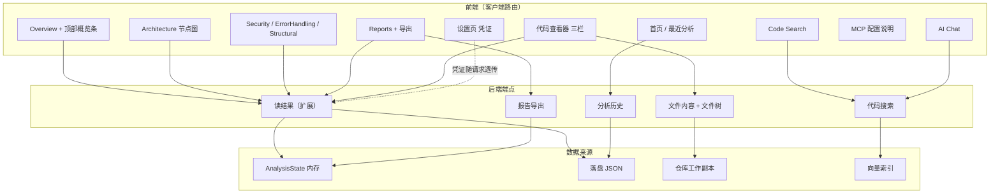
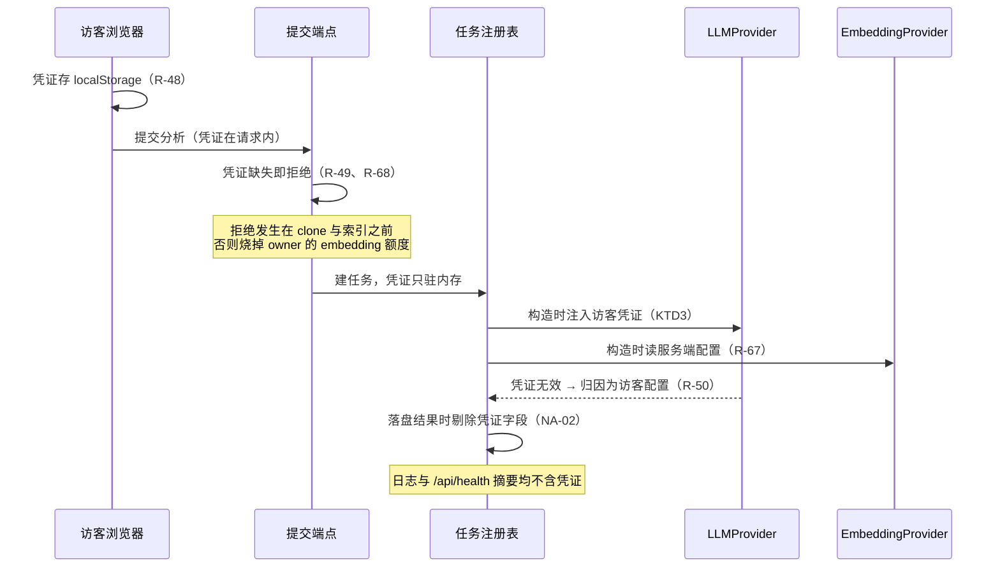
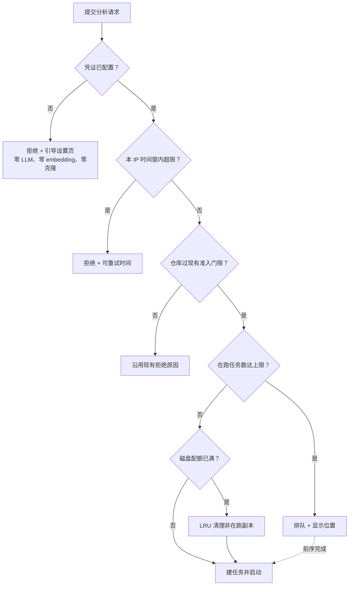

# Code Intelligence 工作台 - Plan

## Goal Capsule

- **目标：** 把 CodePilot 从单页锚点滚动的结果展示器改成 9 页代码情报工作台，并首次具备公网部署形态——访客自带 LLM 凭证，服务端不存凭证，靠 IP 限流、并发闸门、磁盘配额护住服务器资源。
- **产品权威：** `docs/brainstorms/2026-08-25-003-code-intelligence-workbench-requirements.md`。R-01~R-68、BR-001~BR-008、NA-01~NA-10、AE-01~AE-23 均以该文件为准，本计划不改产品语义。
- **推荐路径：** 先立契约再铺页面。四条前置（路由外壳、读结果契约加法扩展、文件读取端点、代码搜索端点）落地后，九个页面各自只是消费方；凭证与三项资源保护在页面之前完成，因为它们是公网形态的上线前提。
- **决策焦点：** 两处。凭证透传的收口位置决定 BR-004「服务端不持久化访客凭证」是结构性成立还是靠约定；读结果契约的扩展方式决定概览条与节点图的数字能否指回后端字段（BR-002 的落点）。
- **验证焦点：** 路径逃逸（R-17、R-57、NA-04）与凭证不落盘（NA-02、NA-03）写真实断言，前者须实际构造符号链接与 junction；节点图的正确性断言在等价文本表达上，不断言渲染结果。
- **最大风险：** 凭证透传改了 LLM 调用的唯一收口点（`backend/providers/llm.py`），而该收口同时服务分析扇出、评审判断、问答三条链路。改错的表现是「某条链路悄悄用了服务端凭证」——功能正常，边界失效，单元测试不一定看得出。缓解方式见 U5 的测试场景：断言未配置凭证时后端不产生任何 LLM 请求。
- **停止条件：** U5~U8（凭证 + 三项资源保护 + 部署参数化）未全部通过前，不改 `docker-compose.yml` 的端口绑定使服务对外可达。P1 尾部（U17~U20）可整段不做而不阻塞上线。
- **执行画像：** 全部代码由 Agent 编写，用户事后通读学习。代码内保留「这块解决什么问题、有哪几种做法、为什么选这个」的注释密度，沿用既有计划的约定。
- **开放阻塞项：** 无。Open Questions 中的四项均为非阻塞。

---

## Product Contract

来源为 legacy 需求文档，本节承载其产品语义。R/AE/NA/BR 编号沿用 origin 的形态（`R-01`、`AE-01`），不重编号——origin 内部的交叉引用、优先级表与追溯矩阵全部按该形态互指，重编号会同时失效。

### Summary

9 个左侧导航页（Overview、Architecture、AI Chat、Code Search、Security Review、Error Handling、Structural、Reports、MCP）加设置页，客户端路由多页切换，URL 可直达可刷新。新增模块节点图、三栏代码查看器、语义检索页、报告导出、最近分析落盘。后端新增 5 类端点。公网部署形态下访客自带 LLM 凭证，服务端不落盘不记日志。所有展示数字只用后端真实字段派生，不引入评分、星级、技术债估算。

### Problem Frame

现有界面是单页纵向流，五个能力区块靠锚点滚动定位。它能展示分析结果，但三件事做不到。

分析产物只能读不能查：报告给出「认证逻辑集中在 auth/jwt.strategy.ts」并附行号，读者点不进那个文件——引用可核验的设计在界面上止步于「显示路径」。依赖图与模块聚类是后端已算出的结构化数据，界面只呈现为文字，读者要在脑子里重建拓扑。只能本地跑：作品的第一接触面是一个需要评审者 clone 仓库、配 key、起容器才能看到的东西。

不做的代价是后端 721 个测试、可追溯报告、三类评审检查、MCP server 这些实质工作，被「必须本地部署才能看」和「结论无法点进去核验」两道门槛挡在评审者之外。

### Requirements

**导航与页面结构**

- R-01. 打开界面时以「左侧导航栏 + 顶部项目概览条 + 主内容区」渲染工作台，左侧导航固定为 9 项：Overview、Architecture、AI Chat、Code Search、Security Review、Error Handling、Structural、Reports、MCP。
- R-02. 点击导航项时切换主内容区为该页并卸载其它页；URL 随之变化且可直接访问与刷新。
- R-03. 分析结果尚未就绪时，除 Overview、Settings、MCP 外的导航项置为不可点并标注原因。
- R-04. 视口宽度小于 960px 时左侧导航转为顶部横向或抽屉式，主内容区占满宽度且不横向溢出。
- R-05. 直接访问某页 URL 而该分析不存在时显示「该分析不存在或已被清理」并给出返回首页入口，不显示空白页。

**顶部概览条（口径硬约束）**

- R-06. 分析结果就绪时概览条显示仓库标识、commit 短 SHA、当前阶段、文件总数、模块数、评审发现总数、索引切块数、语言分布。
- R-07. 不显示 Stars、代码行数、技术债估时、Agent 星级评分或任何评分数值。
- R-08. 每个统计数字能指回具体后端字段，不由前端估算、推断或加权合成。

**Architecture 页**

- R-09. 渲染模块节点图：节点为 `modules` 的成员，边为 `dependency_graph` 的跨模块依赖方向。
- R-10. 点击节点时侧栏显示该模块的名称、成员文件清单、内部边数、外部边数、聚类来历、该模块的分析结论原文。
- R-11. 节点详情的「职责」直接呈现 `ModuleAnalysis.summary` 原文，不由前端重新概括；`limitation` 非空时标注该分析不完整。
- R-12. 点击节点详情里的文件路径时跳转到代码查看器并定位到该文件。
- R-13. 依赖图降级为目录级粒度时在图上显式标注降级及原因，不静默以粗粒度呈现。
- R-14. 不渲染函数级调用链或调用关系边。

**代码查看器**

- R-15. 进入代码查看器时渲染三栏：文件树、代码正文、该文件的评审发现。
- R-16. 点击文件树某文件时请求该文件内容并渲染，带行号。
- R-17. 请求文件内容时复用 `resolve_within` 做路径校验，拒绝仓库外路径与符号链接/junction。
- R-18. 文件超过体积上限时返回前 N 行并标注「已截断，共 M 行」，不静默截断。
- R-19. 打开某文件时右栏显示该文件已有的评审发现（path 匹配），每条含行号、严重度、message、evidence。
- R-20. 打开的文件没有评审发现时右栏区分「该文件不在评审目标范围内」与「在范围内但零命中」。
- R-21. 渲染右栏时不为当前文件发起新的 LLM 调用；右栏内容只来自已有评审发现。
- R-22. 评审发现的 `line` 为 0 时呈现为「属于文件整体」而非跳转到第 0 行。
- R-23. 从报告或评审页点击某条引用时跳转到代码查看器并定位到该路径与行号。

**Code Search 与 AI Chat**

- R-24. 在 Code Search 页提交查询时做向量语义检索并返回命中块的路径、行范围、符号名、代码片段。
- R-25. 该仓库尚未建立向量索引时明确说明「未建索引」而非「未找到」，两者不混同。
- R-26. 点击检索结果时跳转到代码查看器并定位到该行范围。
- R-27. 在 AI Chat 页提问时给出回答并附引用（路径 + 起止行 + 符号名），未找到时明确说明且不显示引用区。
- R-28. AI Chat 的每条引用可点击跳转到代码查看器对应位置。
- R-29. 连续提问时每次独立处理、不保留上下文，且界面说明这一点。

**三个评审页与 Reports 页**

- R-30. 进入 Security Review / Error Handling / Structural 任一页时只显示该类别的发现，按严重度分组并显示各组计数。
- R-31. 某类检查未执行时对应页显示未执行及原因，不显示为「零发现」。
- R-32. 某类检查已执行且零命中时显示「已执行，零命中」并给出该类检查的覆盖范围说明。
- R-33. 点击某条发现时跳转到代码查看器并定位到该 path 与 line。
- R-34. 进入 Reports 页时显示架构报告全文（五节带引用）、评审执行情况表、引用校验通过率、缺失部分说明。
- R-35. 不显示架构评分、代码质量分、安全分或任何 0-100 的合成分数。
- R-36. 报告存在无法核验的结论时显式呈现 `unsupported_claims` 与被丢弃结论数，不隐藏。
- R-37. 引用路径与行号用等宽字体完整呈现，不截断；超宽时容器横向滚动。

**报告导出**

- R-38. 在 Reports 页支持 Markdown、HTML、PDF 三种格式导出当次分析的报告与评审发现。
- R-39. 导出内容包含引用路径与行号、评审执行情况、缺失说明，与界面呈现的口径一致。
- R-40. PDF 生成失败时明确报错并提示可改用 Markdown 或 HTML，不返回损坏文件。

**首页与最近分析**

- R-41. 打开首页时显示仓库地址输入框、开始分析按钮，以及「最近分析」列表。
- R-42. 「最近分析」每条显示仓库标识、commit 短 SHA、分析时间、文件数与发现数；不显示星级评分。
- R-43. 分析完成时将该次 `AnalysisResult` 落盘为 JSON。
- R-44. 服务启动时扫描落盘目录重建「最近分析」列表；单个文件损坏时跳过该条并计数，不影响整个列表。
- R-45. 点击「最近分析」某条时载入该次分析结果并进入 Overview 页。
- R-46. 未完成的分析任务在服务重启后不出现在「最近分析」列表中；界面不声称它可恢复。

**设置页与凭证边界**

- R-47. 进入设置页时允许配置 LLM base_url、API key、flash 档模型名、pro 档模型名。
- R-48. 访客凭证只存在访客浏览器本地，不发送到服务端持久化、不写入服务端日志。
- R-49. 访客未配置凭证即提交分析时拒绝提交并引导至设置页；不回落使用服务端配置的凭证。
- R-50. 访客配置的凭证无效时明确提示是访客自己配置的凭证问题，并指向设置页。
- R-51. API key 输入框默认掩码显示，不在任何界面文本、日志或导出内容中回显完整 key。
- R-52. 用户清除设置时从浏览器本地移除凭证。
- R-67. 设置页不出现 embedding provider、embedding key 或 embedding 模型名的配置项；说明向量索引由服务端统一构建。
- R-68. 访客未配置 LLM 凭证即提交分析时，拦截发生在提交阶段，不先执行索引链路再失败。

**公网部署与资源保护**

- R-53. 同一 IP 在时间窗内提交分析次数超过上限时拒绝新提交并返回明确的限流说明与可重试时间。
- R-54. 同时在跑的分析任务数达到上限时排队而非拒绝，并向用户显示排队位置。
- R-55. 仓库工作副本总量达到磁盘配额时按最近最少使用清理，且不清理正在分析的仓库。
- R-56. 请求的仓库超出现有准入门限时沿用现有准入拒绝逻辑并说明原因。
- R-57. 部署到公网时文件读取端点限制在已分析仓库的工作副本内，不暴露服务器其它路径。

**MCP 页**

- R-58. 进入 MCP 页时显示 7 个工具的名称与用途说明，以及 Cursor / Claude Code 的配置片段。
- R-59. 不显示 MCP server 的运行状态灯或连接状态。
- R-60. 说明 MCP 工具读取的是已分析仓库的本地数据，需先完成一次分析。

**视觉与可访问性**

- R-61. 沿用 `#303d67` / `#79799a` / `#fddfdc` 派生的深色令牌体系。
- R-62. 以该三色渐变作为页面底色。
- R-63. 渐变底色不影响正文与代码的可读对比度。
- R-64. 导航项、输入框、按钮、文件树节点、图节点可 Tab 到达且焦点态可见。
- R-65. 页面切换后焦点移至新页主标题，且切换被读屏播报。
- R-66. 渲染模块节点图时同时提供等价的文本形式（模块清单与依赖关系表），不只有图形一种表达。

### Business Rules

- BR-001. 导航形态改为多页切换。既有 `App.test.tsx` 三组 describe 依赖「完成态下报告/评审/问答三个 `h2` 共存」，多页切换后任一时刻只有一页在 DOM，这些测试必须改写为「先切页 → 再断言」。允许改写测试写法，不允许删除断言或降低覆盖。
- BR-002. 不引入任何后端无数据源的数字。禁止架构评分、代码质量分、安全分、技术债估时、Agent 星级、Stars、代码行数。所有展示数字必须能指回具体后端字段。
- BR-003. 导出内容与界面呈现的口径必须一致。同一份分析在界面上说「25/26 条引用通过校验」，导出里不得是别的数字。
- BR-004. 服务端不得持久化访客 LLM 凭证。不落盘、不写日志、不进错误上报。访客未配置时不得回落使用服务端 `.env` 的凭证。
- BR-005. 渐变底色不得压过正文与代码可读性。
- BR-006. 模块节点图必须有等价文本表达。图形是增强而非唯一通道。
- BR-007. 新增的文件读取端点必须复用 `resolve_within`，不得放宽路径校验（KTD14/KTD15）。
- BR-008. 分析流水线的八个节点、SSE 生命周期、引用校验链路本次不动。

### Negative Acceptance

以下情形必须**不**发生。它们是本期最容易被侵蚀的边界，每条都有明确判定方式。

- NA-01（BR-002）界面任何位置不出现架构评分、代码质量分、安全分、技术债估时、Agent 星级、Stars 数、代码总行数。判定：全站文本搜索这些标签无命中。
- NA-02（BR-004）服务端不持久化访客凭证。判定：访客配置并触发一次分析后，服务端日志、`.workspace` 落盘文件、错误上报中均不含该 key 的完整值。
- NA-03（R-49）访客未配置凭证时不回落使用服务端凭证。判定：清空访客配置后提交分析，服务端不产生任何 LLM 请求。
- NA-04（R-17、R-57）文件读取端点不返回工作副本之外的内容。判定：路径穿越、绝对路径、符号链接、junction 四类输入全部被拒。
- NA-05（R-14）不渲染函数级调用链。判定：Architecture 页不存在「调用」语义的边或子视图。
- NA-06（R-59）不显示 MCP 运行状态。判定：MCP 页无状态灯、无「Running」字样。
- NA-07（R-21）打开文件不触发 LLM 调用。判定：连续打开 10 个文件，LLM 请求计数不变。
- NA-08（BR-001）改写测试不降低覆盖。判定：改写后测试数不少于 53，且原有断言语义保留。
- NA-09（R-31、R-32、R-20）零命中与未执行不混同呈现。判定：两种状态的界面文案不同且都非空。
- NA-10（R-46）不声称未完成任务可恢复。判定：重启后界面无「继续」「恢复」类入口指向已丢失的任务。

### Acceptance Examples

完整 Given/When/Then 见 origin 的 Acceptance Examples 一节。此处列出编号与主题供单元的测试场景引用：

| 编号 | 主题 | 覆盖需求 |
| --- | --- | --- |
| AE-01 | 多页导航与直达 | R-01、R-02、R-03 |
| AE-02 | 概览口径 | R-06、R-07、R-08 |
| AE-03 | 节点图与下钻 | R-09~R-12 |
| AE-04 | 图的降级与边界 | R-13、R-14、R-66 |
| AE-05 | 查看器三栏与右栏来源 | R-15、R-16、R-19、R-20、R-21 |
| AE-06 | 查看器的安全与截断 | R-17、R-18、R-57 |
| AE-07 | 引用可点进去核验 | R-23、R-26、R-28、R-33 |
| AE-08 | 检索与未建索引的区分 | R-24、R-25 |
| AE-09 | 零命中与未执行可区分 | R-30、R-31、R-32 |
| AE-10 | 报告页口径 | R-34、R-35、R-36 |
| AE-11 | 首页与历史 | R-41、R-42、R-45、R-46 |
| AE-12 | 落盘与部分损坏 | R-43、R-44 |
| AE-13 | 访客凭证边界 | R-47~R-50 |
| AE-14 | 导出 | R-38、R-39、R-40 |
| AE-15 | 公网资源保护 | R-53、R-54、R-55 |
| AE-16 | MCP 页 | R-58、R-59、R-60 |
| AE-17 | 视觉与可访问 | R-61~R-66 |
| AE-18 | 失效链接 | R-05 |
| AE-19 | 窄视口与引用不截断 | R-04、R-37 |
| AE-20 | 问答的引用与单轮语义 | R-27、R-29 |
| AE-21 | 凭证不回显与可撤回 | R-51、R-52 |
| AE-22 | 文件级问题与超规模仓库 | R-22、R-56 |
| AE-23 | 嵌入凭证不开放且拦截在提交阶段 | R-67、R-68 |

### Priority

阻塞上线的为 P0，可降级的为 P1。完整降级方案见 origin 的优先级分级表。

- **P0 / Must：** R-01~R-03、R-05~R-11、R-13~R-21、R-23~R-25、R-27、R-30~R-32、R-34~R-37、R-39、R-41、R-42、R-46~R-51、R-53~R-57、R-61、R-63~R-68。
- **P1 / Should：** R-04、R-12、R-22、R-26、R-28、R-29、R-33、R-38、R-40、R-43~R-45、R-52、R-58~R-60、R-62。

P1 中 R-38/R-40（导出）、R-43~R-45（持久化）、R-58~R-60（MCP 页）构成本计划的可砍尾部（U17~U20）。其余 P1 项散落在 P0 单元内，实现成本低于单独摘出的成本。

### Product Scope Boundaries

**本期不做（Non-Goals，产品定位决定）**

- 函数级调用链与调用图。解析层不提取调用点（`README.md:130-132`），`find_references` 是依赖图定界的文本匹配。要做需先补符号级引用分析，属独立需求。
- Performance 类检查与 Performance 页。后端 `FindingCategory` 只有三类，新增一类需要检测器 + 判断 prompt + 基准验证。
- 通用 Bug 类检查。Bug Review 在本期落为 Error Handling 页，对应真实存在的 `error_handling` 类别。
- MCP 运行状态观测。MCP 走 stdio 由客户端拉起子进程，后端架构上观测不到。
- 架构评分 / 代码质量分 / 安全分 / 技术债估时 / Agent 星级 / Stars / 代码行数。
- 多用户、账号体系、协作、分享。本期是无鉴权 + 访客自带 key 形态。
- 未完成任务的断点恢复。任务状态仍在进程内存，重启即丢。
- 服务端托管 LLM 凭证的多租户方案。
- 浅色主题与主题切换。
- 私有仓库接入。
- 多轮问答与 query 改写。`README.md:138` 明列问答是单轮。

**与其它文档的关系**

- supersede `docs/brainstorms/2026-08-25-002-ui-workbench-redesign-requirements.md`。该 PRD 的 BR-001/002/003/006 四条硬约束本次全部被推翻，其视觉令牌成果（`styles.css` 色阶体系）继续沿用。
- 依赖 `docs/plans/2026-08-23-001-feat-codepilot-agent-plan.md` 的 U12（FastAPI 后端与 SSE）与 U13（React 前端）：SSE 生命周期、失败四分类、可访问交互三项要求继承不变。该计划的「浏览式代码浏览器在产品定位之外」与「单页应用，无路由」两条被本期推翻。
- 依赖 `backend/paths.py` 的 KTD14/KTD15：新增文件读取端点复用同一校验且不放宽。

---

## Planning Contract

### Key Technical Decisions

**KTD1. 路由用 `react-router-dom@7.18.2`，不自建也不上 v8。**（session-settled: user-directed — chosen over 手写 history 路由：优先实现速度与成熟交互，接受新增依赖与 bundle 成本）

v8.3.0 的 peer 要求是 `react >=19.2.7`，而项目钉在 `react@19.2.0`；v7.18.2 的 peer 是 `react >=18`，装上即可用，自带类型定义，依赖只有同版本的 `react-router`。选 v7 是为了不把「加路由」和「升 React」两件事绑在一起——后者会让 53 个既有测试的失败原因变得不可分辨。用 declarative 模式（`BrowserRouter` + `Routes` + `Route`），不用 data/framework 模式：本期没有 loader/action 需求，framework 模式还要求改构建入口。

升 v8 的路径保持开放：`react@19.2.8` 已发布，届时只需同时改两个版本号。

**KTD2. 节点图用 `@xyflow/react@12.11.5` + `@dagrejs/dagre@3.1.1` 算布局。**（session-settled: user-directed — chosen over 手写 SVG 分层布局：接受 bundle 与键盘可达适配成本，换布局质量与缩放平移）

`reactflow` 在 v12 已改名 `@xyflow/react`，写旧包名会装到停止更新的版本。peer 是 `react >=17`，与当前版本无冲突。布局用 `@dagrejs/dagre`——上游 `dagre` 已声明停维护，`@dagrejs/dagre` 是官方 fork 且自带类型定义，无需 `@types/dagre`。`elkjs@0.12.0` 是另一选择，但它是 GWT 编译产物、体积大且异步 API，模块数通常小于 40 的场景用不上它的布局质量。

R-64 要求图节点可 Tab 到达：React Flow 的节点默认不在 tab 序列里，需要在自定义节点上显式给 `tabIndex` 与焦点样式。这是选库的已知代价，写进 U10 的实现范围。

**KTD3. 访客凭证在 `LLMProvider` 层按请求覆盖，不改 `Settings`，不新开 provider 路径。**（架构姿态：`extend` 现有 owner）

`backend/providers/llm.py` 是全部 LLM 调用的唯一收口点（其 docstring 与并发闸门的注释都以此为前提），现有构造点只有两处：`backend/api/tasks.py:122`（分析任务）与 `backend/api/routes.py:203`（问答）。给 `LLMProvider.__init__` 增加一个可选的凭证参数，非空时覆盖 `base_url` / `api_key` / 两个模型名，为空时沿用 `Settings`——收口点不变，闸门与重试逻辑不动。

为什么不用 `settings.model_copy(update=...)`：那会让凭证成为 Settings 的一部分，而 Settings 被 `/api/health` 摘要输出、被日志打印、被 `lru_cache` 缓存。凭证挂在其上，BR-004 就得靠「记得不要打印」维持，而不是结构上不可能。独立参数让「凭证不进 Settings」成为类型层面的事实。

嵌入侧不受影响：`build_embedding_provider(settings)` 三个调用点全部继续读服务端配置（R-67、D10）。两者在同一入口分流——同一个请求里，LLM 用访客凭证，embedding 用服务端凭证。

**并发闸门必须同时从实例级提到全局。** 这是本 KTD 最容易漏掉的连带后果。`LLMProvider._gate` 现在是实例级信号量（`backend/providers/llm.py:73`），而现状下全进程只有一两个 provider 实例，所以它事实上等于全局闸门。改成按请求构造之后，每个任务各有一个实例、各有一个闸门，全局在途请求数变成 `并发任务数 × llm_max_concurrency`——按 U6 的默认值是 4。而 `backend/config.py:52` 记录的实测是「经中转网关时 3 路并发就触发 Cloudflare 524，四次重试全撞在饱和的网关上，模块分析随之失败」。不处理这一点等于把一个已知的生产故障重新引入。

闸门改为进程级共享，键为凭证身份（base_url + api_key 的摘要，不含明文）。同一访客的请求共用一个名额池，不同访客各自一池——全局单池会让一个访客的分析卡住另一个访客，而实测的饱和点在网关侧，同一 base_url 的访客才真正互相影响。另加一道全局总闸（默认取 `llm_max_concurrency × 2`）兜住「多个不同 base_url 的访客同时在跑」的情形，避免总在途数无上界。

这让 `llm_max_concurrency` 的语义从「本 provider 实例的在途上限」变为「同一凭证身份的在途上限」，配置注释需同步更新，否则下一个读者会按旧语义推算。

**KTD4. 读结果契约做加法扩展，不新开数据端点。**（架构姿态：`extend`；接口演进分类：additive）

概览条要文件数/模块数/发现数/切块数/语言分布，Architecture 页要模块与依赖图，而 `ResultResponse` 当前只有 report/review/index/module_failures。新增端点的代价是前端要为一个页面发两次请求、两份响应的一致性要自己保证；而 `AnalysisState` 里 `modules`、`dependency_graph`、`language_profile`、`commit_sha` 都已存在，缺的只是 API 层的映射。

按 `backend/api/schemas.py` 既有约定新增响应模型（不直接序列化内部 dataclass），全部字段可选或有默认值——旧字段语义不变，现有前端类型只增不改。`commit_sha` 从 `report.commit_sha` 提升到顶层：报告为 None 时概览条仍要显示它。

**KTD5. 落盘历史镜像 API 契约形状并带 `schema_version`。**（架构姿态：`new` 持久化边界，被拒绝的 owner 是向量索引缓存）

`AnalysisResult` 落盘（R-43）引入本项目第二个持久化面。不复用向量索引的缓存键机制：那套键含 `provider_identity` 并服务「同一仓库同一 commit 的索引可否复用」，而历史列表要的是「这次分析发生过、结果是什么」，两者失效条件不同（换 embedding provider 应让索引失效，不应让历史消失）。

存 `ResultResponse` 的形状而非 pickle 内部 dataclass：内部类型会随实现演进，而落盘文件的读者是下一次进程启动。带 `schema_version` 整数字段——版本不认识时跳过该条并计入损坏计数（R-44 已要求单文件损坏跳过，版本不匹配走同一条路径）。

**KTD6. 限流、闸门、配额三者都是进程内实现，不引入 Redis。**

后端固定单 worker（`backend/Dockerfile:61` 的注释说明原因：任务状态在进程内存）。单 worker 下进程内计数器就是全局真相，引入外部存储只增加故障面。三者拆成三个独立模块而非一个「资源保护」模块：限流看 IP 与时间窗，闸门看在跑任务数，配额看磁盘字节数——三种触发条件、三种降级行为（拒绝 / 排队 / 后台清理），合成一个模块会让它同时依赖请求上下文、任务注册表与文件系统。

横向扩展需要先把任务状态外置，那是独立工作，不在本期。

**配额清理需要一道下限，防止清理与克隆互相追赶。** 配额已满时每次新分析都清掉上一个仓库副本，下一次分析同一仓库又要重新克隆——两者互相追赶，磁盘占用始终贴着上限，而克隆的 CPU 与带宽被反复付出。

代价的准确范围是克隆与解析，不含向量化：索引缓存键是 `repo + commit_sha + provider_identity`（`backend/cache/key.py`），同一 commit 重新克隆后键不变，`store.exists()` 为真即命中缓存（`backend/graph/real_nodes.py:213`），embedding 不重算。配额清理也不触及索引目录（KTD10）。所以这是资源浪费而非额度损失。

下限的形态：单次清理的回收量不低于一个阈值（如配额的 10%），否则不清理并记 warning——宁可让本次分析因磁盘不足而失败并说明原因，也不做一次收益微小的清理。这让「配额太小以致放不下两个仓库」这类配置错误以明确失败暴露，而不是表现为「系统能跑但一直在克隆」。

**KTD7. 导出 MD/HTML 服务端零依赖渲染；PDF 用 `weasyprint@69.0` 并给后端镜像加中文字体层。**

MD 与 HTML 由 `ReportModel` 与 `ReviewModel` 直接渲染，无新依赖，与界面共用同一份数据来源（BR-003 的口径一致因此是结构性的，不靠对照）。

PDF 三条路：`weasyprint` 需要 `libpango`、`libharfbuzz` 与一个中文字体（`fonts-noto-cjk`），镜像约 +80MB；`reportlab` 的 CID 字体不嵌入字形，部分阅读器渲染成方块；浏览器打印零依赖，但服务端拿不到失败信号，而 R-40 要求「PDF 生成失败时明确报错」——没有服务端失败点，那条需求只能落空。选 weasyprint。

PDF 是 P1 且可降级为「不提供 PDF」，所以它独占一个单元（U18），镜像体积成为问题时整段不做，MD/HTML 不受影响。

**KTD8. 节点图的正确性断言落在等价文本表达上，不断言渲染出的图。**

jsdom 没有布局引擎，所有元素的尺寸恒为 0；React Flow 依赖容器尺寸决定渲染，且需要 `ResizeObserver`（jsdom 不提供）。硬测渲染结果会得到一批「通过但没验证任何东西」的绿灯。

BR-006 本来就要求节点图有等价的模块清单与依赖关系表，那份文本是真实的可断言产出：模块数、边的方向、降级标注、`limitation` 标注全部在其中。`ResizeObserver` 在 `src/test/setup.ts` 里 mock 掉，只为让组件不抛异常挂载。图形本身的可用性由浏览器实跑核对承担，写进 Verification Contract。

**KTD9. 部署改动止于 compose 端口绑定与 CORS 参数化，TLS 与域名由外部反代承担。**（session-settled: user-directed — chosen over 只改应用层 / 含完整反代编排）

容器内已绑 `0.0.0.0`（`backend/Dockerfile:62`），对外可达只差 compose 的端口映射。`cors_origins` 已是配置项且注释明写「部署到公网时应改成实际域名」，改为从环境变量注入即可。反代的要求写进 README：终止 TLS、透传真实客户端 IP——后者是 R-53 的前提，反代不透传的话限流会按反代 IP 计数，等于全站共用一个配额。

不做反代配置本身：证书签发依赖真实域名，单元测试覆盖不到，而它与本期的应用层逻辑无耦合。

**KTD10. 代码查看器有四种空态，工作副本已清理是第四种。**（session-settled: user-directed — chosen over 整条历史失效 / 保留最近 N 份副本）

前三种来自 R-20：文件不在评审范围、在范围内零命中、文件本身无发现。第四种是磁盘配额 LRU 清理掉工作副本之后——落盘的 JSON 还在，报告、评审发现、模块图全部可读，只有查看器与 Code Search 读不到源文件。

这是 origin 未覆盖的边界：origin 的 Exception Handling 写「被清理的历史链接失效（R-05）」，但 R-05 说的是分析不存在，而配额清理只删仓库副本、不删落盘 JSON。按 owner 本次决定，落盘 JSON 与工作副本解耦：历史条目仍可载入，查看器与 Code Search 显示「代码副本已清理，无法查看源文件」。代价是多一种空态要实现与测试。

**KTD11. 三项保护各自暴露一个可数的拒绝原因与一组当前用量，回滚动作是把绑定改回本地。**

公网部署把三个新的失败模式引入线上，而它们的共同特征是**从外部看起来像正常运行**：限流把真实访客全拒了、队列积压导致提交后长期无进展、配额贴顶导致反复克隆——三者都不产生错误页，服务健康检查也全绿。没有可见信号，owner 只能等到有人反馈才知道。

要检测什么、谁响应、能做什么决定，先于选指标。三个问题各自对应一个信号：

- 限流是否在拒绝真实访客——每次拒绝记一条带原因的结构化日志（原因取限流/闸门/配额/凭证四类之一），可按原因计数。原因是稳定字段，文案不是。
- 队列是否积压——`/api/health` 增加当前在途任务数与队列长度。
- 配额是否贴顶——`/api/health` 增加工作副本总占用与配额上限，以及最近一次清理的回收量。

不引入指标系统、不接 Prometheus、不配告警：单机单 worker 的部署规模下，`/api/health` 加结构化日志就是可查询路径，而 owner 是唯一响应者。判定信号可用的方式是实跑一次限流触发并在日志里数到那条记录（写进 U6 的测试场景），不是「加了监控」。

回滚触发条件与动作：出现滥用（单 IP 绕过限流、磁盘被打满、embedding 额度异常消耗）时，把 compose 的绑定地址改回 `127.0.0.1` 并重启——这是一步可逆动作，不涉及数据迁移，因为本期没有任何 schema 变更需要回退。落盘的历史 JSON 在回滚后仍可读。这也是为什么 U8 的默认绑定值保持 `127.0.0.1`：回滚等于删掉一个环境变量。

### Interface Contracts

新增 5 类端点，全部 greenfield；`ResultResponse` 为 evolution/additive。参数校验与错误 `reason` 沿用 `backend/api/schemas.py` 的既有约定（`ErrorResponse` 带稳定的 `reason` 字段，文案在 `message` 里）。

| 接口 / 模式 | 消费方 | 规范载体 | 契约要点 | 兼容性 | 验证 |
| --- | --- | --- | --- | --- | --- |
| 读结果扩展 / evolution | Overview 条、Architecture 页、Reports 页 | `backend/api/schemas.py` 的 `ResultResponse`（U2） | 新增 modules、dependency_graph、language_profile、顶层 commit_sha、评审目标范围；全部可选或带默认值 | additive，旧字段语义与前端类型均不变 | `tests/test_api.py` 断言新字段存在且与 state 一致（U2） |
| 文件内容读取 / greenfield | 代码查看器中栏、引用下钻 | `backend/api/files.py` + schemas（U3） | 入参 task_id + 仓库相对路径 + 可选行范围；出参含内容、起止行、总行数、截断说明；路径非法与文件不存在是两个 reason | 新增，无消费方迁移 | `tests/test_api_files.py` 实构符号链接与 junction（U3） |
| 文件树 / greenfield | 代码查看器左栏 | 同上（U3） | 单层列目录，复用 `list_structure` 的跳过目录集与条目上限 | 新增 | 同上 |
| 代码搜索 / greenfield | Code Search 页 | `backend/api/search.py` + schemas（U4） | 入参 task_id + query + limit；出参命中块的路径、行范围、符号名、片段、距离；「未建索引」与「未找到」是两个 reason | 新增 | `tests/test_api_search.py`（U4） |
| 报告导出 / greenfield | Reports 页导出按钮 | `backend/api/export.py`（U17、U18） | 入参 task_id + format；出参文件流带 Content-Disposition；PDF 失败返回可区分的 reason | 新增 | `tests/test_export.py`（U17、U18） |
| 分析历史 / greenfield | 首页最近分析列表 | `backend/api/schemas.py` 的历史条目模型（U9、U19） | 出参每条含仓库标识、commit 短 SHA、时间、文件数、发现数；不含评分字段 | 现有 `GET /api/analyses` 返回 `TaskSummary`，本期扩展该端点而非新增路径 | `tests/test_api.py` 断言损坏文件被跳过并计数（U19） |
| 落盘历史文件 / greenfield | 服务启动扫描 | `.workspace/analyses/{task_id}.json`（U19） | 镜像 `ResultResponse` 形状 + `schema_version` 整数；不含任何凭证字段 | 版本不认识时跳过并计入损坏计数 | `tests/test_history_store.py`（U19） |

`parser_unavailable`：本仓库无 OpenAPI schema 校验器或契约测试框架。替代证据是 `tests/test_api.py` 的响应形状断言（FastAPI 的 `response_model` 会在运行时校验），以及 `mypy backend` 对 Pydantic 模型的静态检查。unblock 条件是引入 schemathesis 或类似工具，本期不做。

### Frontend Engineering Decisions

- **组件边界与复用。** 现有 `AppShell`、`ReportView`、`ReviewFindings`、`QaPanel`、`StatStrip`、`RepoInput`、`ProgressPanel` 全部保留并复用。`AppShell` 的职责从「锚点滚动 + IntersectionObserver 纠正」改为「路由导航 + 焦点管理」，IntersectionObserver 逻辑整段删除——多页形态下任一时刻只有一页在 DOM，没有可观测的多个区块。`ReportView` 与 `ReviewFindings` 从「被 App 直接渲染」改为「被对应页渲染」，组件内部不变，只是引用变成可点（U11）。
- **状态归属。** 分析结果由路由顶层持有并按 task_id 缓存，九个页面读同一份——避免每次切页重新拉取。访客凭证由独立的 settings 模块持有，读写 localStorage，不进分析结果的状态树。查看器的当前文件与代码内容是页面局部状态，切页即丢（重新打开时重新请求，代价是一次 HTTP 请求，换来不必维护跨页缓存的失效逻辑）。
- **状态矩阵。** 每个数据页覆盖：初始、加载中、成功、空态、失败、结果未就绪（R-03 的不可点）、分析不存在或已清理（R-05）。查看器额外覆盖 KTD10 的四种右栏空态与「代码副本已清理」。Code Search 额外覆盖「未建索引」与「未找到」的区分（R-25）。重复提交在提交中与分析中被阻止，沿用 `App.tsx:122` 的双重防护（按钮 disabled + 函数入口判断）。
- **可访问交互。** 导航项用 `<button>` 或 `<Link>`（可 Tab、可回车），当前项带 `aria-current`。页面切换后焦点移至新页 `<h1>`/`<h2>` 并由 live region 播报（R-65）——现有 `ProgressPanel` 与 `ReportView` 的 `focusOnMount` 已建立该模式，沿用。文件树节点与图节点显式给 `tabIndex` 与可见焦点态（R-64）。渐变底色下正文与代码区域用不透明背景层保对比度（R-63、BR-005）。
- **响应式。** 关键视口 1440 / 1024 / 900 / 375。小于 960px 时导航转抽屉式（R-04）；查看器三栏在窄视口折叠为「文件树抽屉 + 代码 + 发现折叠区」；引用路径超宽时由其容器横向滚动，不撑破整页（R-37、AE-19）。
- **运行时验证边界。** 组件测试能证明的：页面切换、空态文案区分、引用可点、焦点转移、文本等价表达的内容。组件测试不能证明的：节点图的实际渲染与缩放平移、渐变底色下的真实对比度、抽屉导航在真实视口下的行为。后三项由浏览器实跑核对承担（见 Verification Contract），未实跑时不得声称已验证。

### High-Level Technical Design

**页面与数据来源的拓扑。** 九页加设置页，全部消费同一份读结果响应；三个页面另需专用端点。

查看器同时要 `FILES`（代码正文）与 `RESULT`（该文件的评审发现），这是 R-19 与 R-21 的直接后果：右栏内容来自已有发现，不重新分析。

**凭证的生命周期。** 这是 BR-004 与 NA-02/NA-03 的落点，也是最容易在实现时失守的一环。

**提交端点的准入闸门。** 四道判断的顺序不可调换：凭证在最前（R-68 要求拦截在提交阶段），准入门限在克隆之前（AE-22 要求不产生克隆残留）。

排队态在服务重启后随进程内存一并丢失，此时不得出现在最近分析列表里，也不得给出「继续」入口——这是 R-46 的延伸（origin 只写了未完成任务，排队态是同一条边界）。

### Assumptions

以下是本计划的规划期假设，origin 未直接确认。它们不改变产品行为语义，实现时可按实际调整并回写本节。

- IP 限流阈值取每小时 3 次、并发上限取 2 个任务、磁盘配额取 20GB。origin 的 Planning Recheck 明写前两个是选项预览中的示例值，第三个未与 owner 确认。三者都做成配置项（`Settings` 字段 + 环境变量），改值不改代码。
- 并发上限与 `llm_max_concurrency=2` 是两个独立旋钮。后者是 LLM 在途请求数（`backend/config.py:58` 的注释说明它是为避开网关限制而设），前者是分析任务数。同名不同物，配置项命名上要能区分。
- 语言分布在概览条显示前 5 项，其余归入「其它」。`LanguageProfile.by_language` 是全量映射，界面需截断，N 未与 owner 确认。
- 节点图布局方向取从上到下的分层布局。模块数通常小于 40，分层比力导向更稳定（同一份数据每次渲染位置一致，截图可复现）。
- 文件树按需展开单层，不预取全树。复用 `list_structure` 的既有语义与跳过目录集。
- 严重度取值只映射 high/medium/low，后端返回其它值时归入 medium 并在该条发现旁标注原值。继承 002 的同名项。

### Implementation Scope Boundaries

以下是本计划自身的范围决定，不属于 origin 的产品 Non-Goals。

- **不改分析流水线。** 八个节点、SSE 生命周期、`validate_report` 校验链路、缓存键机制一律不动（BR-008）。唯一例外是 `LLMProvider` 构造参数的扩展（KTD3），它不改节点逻辑。
- **不做反代与 TLS 配置本身。** 只改 compose 端口绑定与 CORS 参数化，并在 README 写明对反代的要求（KTD9）。
- **不引入外部存储。** 限流、闸门、配额、任务状态全部进程内（KTD6）。
- **不迁移 MCP 到 2.x。** `pyproject.toml` 已钉住 `mcp>=1.27,<2` 并注明升级是独立工作。
- **不重构现有 6 个端点。** 全部加法：`ResultResponse` 加字段，`GET /api/analyses` 扩展返回形状，其余不动。
- **不做未完成任务的断点恢复。** 任务状态仍在进程内存。
- **不升 React。** 路由选 v7 正是为了避开这件事（KTD1）。

### Evidence & Limitations

- **本地实测（2026-08-26）。** 前端 `npm test` 53 passed（`App.test.tsx` 36 个 `it(` + `Workbench.test.tsx` 13 个 `it(`，`test.each` 展开后共 53）；`npm run typecheck` 干净；后端全量 721 passed / 1 skipped。NA-08 的「不少于 53」以此为基线。
- **依赖版本经 npm registry 查询确认。** `react-router@8.3.0` 的 peer 为 `react >=19.2.7`；`react-router-dom@7.18.2` 的 peer 为 `react >=18` 且未标记 deprecated，依赖 `react-router@7.18.2`，自带类型；`@xyflow/react@12.11.5` 的 peer 为 `react >=17`；`@dagrejs/dagre@3.1.1` 自带类型；`elkjs@0.12.0`；`weasyprint@69.0`。项目当前 `react@19.2.0`，registry 最新 `19.2.8`。
- **`dagre` 上游停维护经外部检索确认**（mermaid 的迁移 issue 记录了这一点），`@dagrejs/dagre` 为官方 fork。React Flow 官方布局文档同时列出 dagre 与 elkjs 两条路。这一项是外部证据，未在本地验证——首次安装时若 fork 状态有变，改用 elkjs 是既定退路。
- **容器已绑 `0.0.0.0`**（`backend/Dockerfile:62`），对外可达只差 compose 端口映射（`docker-compose.yml` 现为 `127.0.0.1:8000:8000` 与 `127.0.0.1:80:80`）。这把 KTD9 的改动面收窄到两处配置。
- **`chunk_and_index` 分支不依赖 LLM**（`backend/graph/builder.py:166` 从 cluster 直连，`backend/graph/real_nodes.py:205` 只构造 embedding provider）。这印证 R-68：未配置 LLM 凭证时若让分析开跑，索引链路仍会消耗 owner 的 embedding 额度，所以拦截必须在提交阶段。
- **未做的研究。** 未实测 weasyprint 在 `python:3.13-slim` 上的中文渲染效果，也未实测 React Flow 在 jsdom 下的具体失败形态。前者是 U18 的第一个动作（P1，失败可整段不做），后者由 KTD8 的规避策略绕开（不断言渲染结果）。两处都不阻塞规划。
- **相关性限制。** 本计划的规划与后续实现若由同一 Agent 完成且无独立人工审查，不构成独立评审证据。origin 的 owner 决定（D1~D10）由用户逐项确认，本次会话的三项决定（KTD1/KTD2、KTD9、KTD10）同样由用户直接选定。

### System-Wide Impact

| 面 | 状态 | 说明 |
| --- | --- | --- |
| 客户端 | in-scope | 单页改多页，9 页 + 设置页；新增 2 个依赖；53 个既有测试改写 |
| 后端服务 | in-scope | 新增 5 类端点、3 个资源保护模块、1 个持久化模块；`LLMProvider` 构造签名扩展 |
| API 契约 | in-scope | `ResultResponse` 与 `GET /api/analyses` additive 扩展；5 类新端点 greenfield |
| 数据 | in-scope | 新增 `.workspace/analyses/` 落盘目录（带 schema_version）；向量索引与仓库副本路径不变 |
| 鉴权与凭证 | in-scope | 首次引入按请求凭证透传；服务端不持久化（BR-004）；仍无鉴权层，靠限流护资源 |
| 运维与部署 | in-scope | compose 端口绑定与 CORS 参数化；后端镜像可能加中文字体层（U18）；README 增补反代要求 |
| 验证与测试 | in-scope | 前端测试改写 + 新页测试；后端新增 4~5 个测试文件；浏览器实跑核对清单 |
| Agent / 工具面 | out-of-scope: MCP server 的 7 个工具与 stdio 传输不变，新增 HTTP 端点不改变工具契约 | 代码搜索端点复用 `search_code` 的逻辑，但两者各自独立收口——MCP 侧不经 HTTP |
| 分析流水线 | out-of-scope: BR-008 明确本次不动 | 八节点、SSE、引用校验链路不变 |

### Risks & Dependencies

| 风险 | 影响 | 缓解 |
| --- | --- | --- |
| 凭证透传改了 LLM 调用的唯一收口点，三条链路共用 | 某条链路悄悄回落服务端凭证，功能正常但 BR-004 失效 | U5 的测试断言未配置凭证时后端零 LLM 请求（NA-03）；断言落盘文件与日志不含 key（NA-02） |
| 新增文件读取端点是公网可达的任意路径入口 | 路径逃逸等于任意文件读取，严重漏洞 | 强制复用 `resolve_within`（BR-007）；U3 的测试实构符号链接与 junction 四类输入（NA-04）；端点先按 task_id 定位工作副本再解析相对路径，不接受绝对路径 |
| 53 个既有测试改写时可能顺手删断言 | 覆盖静默下降，回归失去防线 | U1 的验证要求改写后测试数不少于 53 且原断言语义保留（NA-08）；改写方式统一为「先切页再断言」，不改断言体 |
| React Flow 在 jsdom 下不可测 | 节点图的测试变成假绿灯 | KTD8：断言落在等价文本表达上；图形可用性由浏览器实跑核对 |
| 排队机制引入新的任务状态，与重启易失性叠加 | 界面可能声称排队中的任务可恢复 | U6 的测试断言重启后排队任务不出现在历史列表（R-46 的延伸） |
| 磁盘配额 LRU 清理与在跑分析竞争 | 清掉正在分析的仓库副本会让分析失败 | U7 的清理逻辑读任务注册表排除在跑仓库；测试场景覆盖「配额触发时唯一可清的是在跑仓库」的情形 |
| weasyprint 的中文字体在 slim 镜像上可能渲染成方块 | 导出的 PDF 不可用 | U18 第一个动作是实跑核对中文渲染；失败则整段不做（P1 可降级为不提供 PDF） |
| 两个新依赖引入传递依赖与 bundle 增长 | 构建体积上升，供应链面扩大 | 版本精确钉住（不用 `^`）；U1 与 U10 各自的验证要求 `npm run build` 通过；不引入 elkjs 与 d3 生态的额外包 |
| 按请求构造 provider 使实例级闸门失去全局约束力 | 全局在途请求数变成并发任务数的倍数，撞上实测已知的网关饱和点（3 路即 524） | KTD3 的闸门提到进程级并按凭证身份分池，另加全局总闸；U5 的测试断言全局在途数不超上限 |
| 三项保护的失败模式从外部看像正常运行 | 限流误拒、队列积压、配额贴顶三者都不产生错误页，owner 无从察觉 | KTD11 的可数拒绝原因与 `/api/health` 用量字段；U6 的测试实跑一次限流并在日志中数到该条记录 |
| 配额清理与克隆互相追赶 | 磁盘始终贴顶，克隆的 CPU 与带宽被反复付出（索引缓存留存，不含额度损失） | KTD6 的回收量下限：低于阈值时不清理并记 warning，让配置错误以明确失败暴露 |

**外部依赖：** `react-router-dom@7.18.2`、`@xyflow/react@12.11.5`、`@dagrejs/dagre@3.1.1`（前端）；`weasyprint@69.0` 与 `fonts-noto-cjk`（后端，仅 U18）。均为 P0/P1 单元的前置，无其它上游依赖。

### Open Questions

四项均为非阻塞，可在实现时定值或按假设推进。

- 磁盘配额的具体容量按部署机器实际磁盘定。假设值 20GB（见 Assumptions），做成配置项。触发条件：部署前需确认目标机器可用磁盘。
- 落盘历史的清理顺序是否需保留最近 N 条。origin 的 Planning Recheck 列为未定。当前假设是配额只清工作副本、不清落盘 JSON（KTD10），落盘 JSON 的清理策略推到实际磁盘压力出现时再定。
- 语言分布展示项数 N。假设 5，见 Assumptions。
- 测试改写的实际数量。origin 估 15~20 个，实测有 8 + 2 个 describe 块共 53 个测试，其中依赖「三个 h2 共存」的是 `App.test.tsx` 的报告渲染、评审呈现、问答三组（第 475、541、571 行起）。实际改写量在 U1 实现时确认，NA-08 的下限不变。

---

## Implementation Units

共 22 个单元，分四段。A 段（U1~U4）立契约：路由外壳与三类端点。B 段（U5~U8）做公网前提：凭证透传、三项资源保护、部署参数化。C 段（U9~U18）铺页面。D 段（U19~U22）是可砍的 P1 尾部与视觉收口。

A、B 两段完成即具备上线条件，C 段决定界面完整度，D 段的导出与持久化可整段不做（对应 origin 优先级表的降级方案）。

### Unit Index

| U-ID | 标题 | 主要文件 | 依赖 |
| --- | --- | --- | --- |
| U1 | 路由外壳与既有测试改写 | `frontend/src/App.tsx`、`components/AppShell.tsx`、`src/routes/`、`src/test/App.test.tsx` | — |
| U2 | 读结果契约加法扩展 | `backend/api/schemas.py`、`backend/api/routes.py` | — |
| U3 | 文件内容与文件树端点 | `backend/api/files.py`、`backend/api/schemas.py` | U2 |
| U4 | 代码搜索端点 | `backend/api/search.py`、`backend/api/schemas.py` | U2 |
| U5 | 访客凭证按请求透传 | `backend/providers/llm.py`、`backend/api/tasks.py`、`backend/api/routes.py` | — |
| U6 | IP 限流与并发闸门 | `backend/api/ratelimit.py`、`backend/api/gate.py`、`backend/api/routes.py` | U5 |
| U7 | 磁盘配额与 LRU 清理 | `backend/workspace/quota.py`、`backend/config.py` | U6 |
| U8 | 部署参数化与反代要求 | `docker-compose.yml`、`backend/config.py`、`README.md` | U6, U7 |
| U9 | 首页与最近分析列表 | `frontend/src/pages/HomePage.tsx`、`src/api/client.ts` | U1, U2 |
| U10 | Overview 页与顶部概览条 | `frontend/src/pages/OverviewPage.tsx`、`components/StatStrip.tsx` | U1, U2 |
| U11 | Architecture 节点图与等价文本 | `frontend/src/pages/ArchitecturePage.tsx`、`components/ModuleGraph.tsx` | U1, U2 |
| U12 | 代码查看器三栏 | `frontend/src/pages/ViewerPage.tsx`、`components/FileTree.tsx`、`components/CodePane.tsx` | U1, U2, U3 |
| U13 | 引用下钻贯通 | `components/ReportView.tsx`、`components/ReviewFindings.tsx`、`src/routes/` | U11, U12 |
| U14 | 三个评审页 | `frontend/src/pages/ReviewPage.tsx` | U1, U2, U13 |
| U15 | Reports 页 | `frontend/src/pages/ReportsPage.tsx` | U1, U2, U13 |
| U16 | Code Search 与 AI Chat 页 | `frontend/src/pages/SearchPage.tsx`、`pages/ChatPage.tsx` | U1, U4, U13 |
| U17 | 设置页与凭证前端边界 | `frontend/src/pages/SettingsPage.tsx`、`src/settings/credentials.ts` | U1, U5 |
| U18 | MCP 配置说明页 | `frontend/src/pages/McpPage.tsx` | U1 |
| U19 | 导出 Markdown 与 HTML | `backend/api/export.py`、`backend/report/render.py` | U2, U15 |
| U20 | 导出 PDF | `backend/api/export.py`、`backend/Dockerfile`、`pyproject.toml` | U19 |
| U21 | 最近分析落盘与启动重建 | `backend/history/store.py`、`backend/api/tasks.py` | U2, U9 |
| U22 | 渐变底色与对比度收口 | `frontend/src/styles.css` | U9~U18 |

U17 在编号上属 C 段但可与 U5 同期开工——它只依赖凭证契约，不依赖其它页面。

### U1. 路由外壳与既有测试改写

- **Goal** 把单页锚点滚动改成客户端路由多页，9 项导航常驻，URL 可直达可刷新；同时把依赖「三个 h2 共存」的既有测试改写为「先切页再断言」。
- **Requirements** R-01、R-02、R-03、R-05、R-64、R-65；BR-001、NA-08。
- **Dependencies** 无。这是全部前端单元的前置。
- **Files**
  - `frontend/package.json`（加 `react-router-dom@7.18.2`，精确版本不用 `^`）
  - `frontend/src/main.tsx`（挂 `BrowserRouter`）
  - `frontend/src/routes/index.tsx`（路由表，9 页 + 设置页 + 首页）
  - `frontend/src/App.tsx`（从状态机渲染五区块改为路由容器 + 分析结果状态持有）
  - `frontend/src/components/AppShell.tsx`（锚点导航改路由导航，删 IntersectionObserver 逻辑，加焦点转移）
  - `frontend/src/pages/`（九个页面骨架，本单元只出标题与空态，内容由 U9~U18 填）
  - `frontend/src/test/App.test.tsx`（改写报告渲染、评审呈现、问答三组 describe）
  - `frontend/src/test/Workbench.test.tsx`（改写「三个区块标题必须同时存在」的防回归断言为「切页后该页标题存在且其它页已卸载」）
  - `frontend/src/test/setup.ts`（加 `ResizeObserver` mock，为 U11 预留）
  - `frontend/src/test/Routing.test.tsx`（新增：导航、直达、刷新、置灰、焦点转移）
- **Approach** `AppShell` 保留左栏 + 顶部条 + 主内容区三块布局，把 `navItems` 的 `onClick` 从 `scrollIntoView` 改为 `navigate`，`active` 从内部 state 改为读当前路由。IntersectionObserver 整段删除——多页形态下没有可观测的多个区块，留着是死代码。分析结果由 `App` 持有并通过 context 或路由 outlet 传给各页，避免每次切页重新拉取。

  未就绪的导航项置灰并标注原因（R-03）：origin 的 AE-01 要求每项标注「需先完成一次分析」，现有实现只置灰不标注，需补。

  测试改写的统一手法：在原断言前插入一次导航（点击对应导航项或直接渲染该路由），断言体本身不动。`Workbench.test.tsx` 的两条防回归断言语义反转——原本钉「三个标题共存」，改为钉「切页后其它页已卸载」，这条新断言承担同样的防回归职责（防止有人把多页改回锚点滚动）。
- **Execution note** 先改测试再改实现。53 个测试里有相当一部分会因为路由缺失而失败，先把改写后的测试跑成红色，再让实现把它们变绿——这样能确认每个断言的失败原因是「还没实现」而不是「断言被改坏了」。
- **Patterns to follow** `AppShell` 现有的 `focusOnMount` 模式（`ProgressPanel`、`ReportView` 已用），焦点转移沿用它；`PHASE_VIEW` 与 `FAILURE_HINTS` 的按 reason 分类呈现不动。
- **Test scenarios**
  - Covers AE-01. 完成态下点击 Architecture 导航项，该页标题出现且 Overview 内容从 DOM 卸载，URL 变为该页地址。
  - Covers AE-01. 直接渲染某页路由并模拟刷新，仍停留在该页。
  - Covers AE-01. 分析未就绪时 Architecture / AI Chat / Code Search / 三个评审页 / Reports 均不可点，且每项带原因文案。
  - Covers AE-01. Overview、Settings、MCP 三项在未就绪时仍可点。
  - Covers AE-18. 访问某页 URL 而该分析不存在时显示「该分析不存在或已被清理」与返回首页入口，不出现空白页或未捕获错误。
  - 切页后焦点落在新页主标题上，且切换被 live region 播报（R-65）。
  - 导航项、输入框、按钮可 Tab 到达且焦点态可见（R-64 的本单元部分）。
  - 浏览器后退与前进在已访问页之间切换，不重新触发分析提交。
  - 分析进行中切换页面时 SSE 连接不中断，进度在 Overview 页继续更新。
  - 改写后的报告渲染、评审呈现、问答三组测试全部通过，断言体与改写前一致。
- **Verification** `npm test` 通过且用例数不少于 53；`npm run typecheck` 与 `npm run build` 干净；改写的三组 describe 的断言体经 diff 核对未删减。

### U2. 读结果契约加法扩展

- **Goal** 让读结果端点返回概览条与 Architecture 页所需的字段：模块、依赖图、语言分布、顶层 commit SHA、评审目标范围。
- **Requirements** R-06、R-08（数字可指回字段的后端侧）、R-09、R-10、R-13、R-20（评审范围区分的数据前提）。
- **Dependencies** 无。
- **Files**
  - `backend/api/schemas.py`（新增 `ModuleModel`、`DependencyGraphModel`、`LanguageProfileModel`；`ResultResponse` 加字段）
  - `backend/api/routes.py`（`_result_response` 补映射，新增对应的 `_module_*` 映射函数）
  - `frontend/src/api/types.ts`（同步类型）
  - `tests/test_api.py`（新增字段的断言）
- **Approach** 沿用 `schemas.py` 开篇的既有约定：显式声明响应模型，不直接序列化内部 dataclass。新增字段全部可选或带默认值，旧字段语义不变——这让前端类型只增不改，现有 53 个测试的固件不必大改。

  映射内容：`modules` 取 `Module` 的 name/files/internal_edges/external_edges/origin，并附该模块的 `ModuleAnalysis.summary` 与 `limitation`（R-11 要求呈现原文，所以 API 层不做任何加工）；`dependency_graph` 取 nodes/edges/granularity/degraded_reason，边按「导入方 → 被导入方」方向保留（R-09 需要方向），`external` 与 `unresolved` 也带上（前者是外部依赖，后者是解析缺口，两者都属报告缺失说明的范畴）；`language_profile` 取 total_files/parseable_files/by_language；`commit_sha` 从 `report.commit_sha` 提升到顶层（报告为 None 时概览条仍要显示）。

  评审目标范围已在 `ReviewModel.target_files` 中，无需新增——R-20 区分「不在范围内」与「零命中」靠它加上 `outcomes` 的 status 即可判定。
- **Patterns to follow** `_report_model` / `_review_model` / `_index_model` 的写法：从 state 取、逐字段映射、缺失返回 None。
- **Test scenarios**
  - Covers AE-02. 一次含 33 文件 / 9 模块 / 6 发现 / 99 切块的分析，读结果返回的各计数与 state 中对应字段一致。
  - Covers AE-02. `language_profile.by_language` 为全量映射，API 不做截断（截断是界面职责）。
  - Covers AE-03. `modules` 每项含成员文件清单、内部边数、外部边数、聚类来历，以及该模块分析结论原文。
  - Covers AE-03. 模块分析带 `limitation` 时该字段在响应中非空。
  - Covers AE-04. 依赖图降级为目录级时 `granularity` 为 directory 且 `degraded_reason` 非空。
  - 依赖图的边方向与 state 中一致（导入方指向被导入方），不被序列化过程反转。
  - 报告为 None（分析失败或未完成）时顶层 `commit_sha` 仍返回 state 中的值。
  - 旧字段 report / review / index / module_failures 的形状与本单元前完全一致（回归）。
- **Verification** `pytest tests/test_api.py` 通过；`mypy backend` 干净；前端 `npm run typecheck` 在同步类型后干净。

### U3. 文件内容与文件树端点

- **Goal** 提供按 task_id + 仓库相对路径读文件内容的端点，与按目录列一层的文件树端点，两者的路径校验复用 `resolve_within`。
- **Requirements** R-15（数据前提）、R-16、R-17、R-18、R-57；BR-007、NA-04。
- **Dependencies** U2（响应模型的既有约定与 task 定位方式）。
- **Files**
  - `backend/api/files.py`（新增：两个端点的实现）
  - `backend/api/schemas.py`（`FileContentModel`、`FileTreeModel`、`FileTreeEntryModel`）
  - `backend/api/routes.py`（挂载）
  - `tests/test_api_files.py`（新增）
- **Approach** 端点先按 task_id 从注册表（或落盘历史）定位工作副本根目录，再把请求的相对路径交给 `resolve_within`。**不接受绝对路径**——`resolve_within` 本身允许绝对路径入参并逐段校验，但在公网端点上多接受一种输入形态就多一种被构造的可能，所以在端点层先拒绝绝对路径，再进校验。这是 R-57 的落点。

  文件内容读取复用 `backend/tools/read_file.py` 的截断语义（默认行数上限、单行字符上限、越界收敛），但上限值按界面需要放宽——Agent 读文件要控上下文成本，界面读文件要给人看完整文件。返回体带 `total_lines` 与截断说明（R-18 要求「已截断，共 M 行」不静默）。

  文件树按需列一层，复用 `list_structure` 的 `SKIP_NAMES` 跳过目录集与条目上限。不预取全树：递归在大仓库上产出上万条目。

  工作副本已被配额清理时返回可区分的 reason（KTD10 的第四态），前端据此显示「代码副本已清理」而非「文件不存在」。
- **Execution note** 路径逃逸的测试必须实际构造符号链接与 junction，不接受字符串层面的断言——沿用既有计划对安全边界的同一要求（`tests/test_paths.py`、`tests/test_ingest_clone_escape.py` 已建立该手法）。
- **Patterns to follow** `backend/tools/read_file.py` 的截断与错误分类；`backend/tools/list_structure.py` 的逐条目校验（`rglob`/`iterdir` 会穿透 reparse point，所以每个条目都要过校验）；`ErrorResponse` 的稳定 reason 约定。
- **Test scenarios**
  - Covers AE-06. 请求 `../../../etc/passwd` 被拒且不返回任何文件内容。
  - Covers AE-06. 仓库内存在指向仓库外的符号链接时，经该链接的路径被拒。
  - Covers AE-06. 同上，Windows junction 被拒（复用 `tests/test_paths.py` 的 junction 构造手法）。
  - Covers AE-06. 绝对路径入参被端点层拒绝，不进入 `resolve_within`。
  - Covers AE-06. 超过体积上限的文件返回前 N 行并带「已截断，共 M 行」说明，不静默截断。
  - 请求不存在的文件返回「文件不存在」的 reason，与「路径非法」是两个不同的 reason。
  - 请求目录路径而非文件时返回可区分的错误，不返回目录内容。
  - 空文件返回空内容与 `total_lines` 为 0，不报错。
  - 文件树只列一层，`node_modules` / `.git` / `__pycache__` 等目录不出现在结果中。
  - 工作副本已被清理时返回该情形专属的 reason，与「文件不存在」可区分。
  - task_id 不存在时返回任务不存在的 reason。
- **Verification** `pytest tests/test_api_files.py` 通过，含四类逃逸输入的实构测试；`mypy backend` 干净。

### U4. 代码搜索端点

- **Goal** 把 MCP `search_code` 的语义检索能力开到 HTTP 层，保持「未建索引」与「未找到」可区分。
- **Requirements** R-24、R-25、R-26（数据前提）。
- **Dependencies** U2。
- **Files**
  - `backend/api/search.py`（新增）
  - `backend/api/schemas.py`（`SearchHitModel`、`SearchResponse`）
  - `backend/api/routes.py`（挂载）
  - `tests/test_api_search.py`（新增）
- **Approach** 复用 `backend/mcp_server/server.py:262-302` 的判定顺序：查询非空 → 构造 embedding provider（服务端凭证，R-67）→ 算缓存键 → `VectorStore.exists()` 判断 → 检索。两处各自独立收口，不让 HTTP 端点去调 MCP 工具函数——MCP 侧返回的是给模型看的文本，HTTP 侧要返回结构化字段（路径、行范围、符号名、片段、距离），中间转换会比各写一遍更绕。

  「未建索引」与「未找到」用两个不同的 reason 表达（R-25），前者是 `store.exists()` 为假或缓存键不匹配，后者是检索返回空。origin 的 AE-08 明确两者不得混同。

  embedding 用服务端凭证而非访客凭证：索引由服务端统一构建（R-67、D10），检索侧必须用同一 provider identity，否则缓存键不匹配、每次检索都报「未建索引」。
- **Patterns to follow** `backend/api/routes.py:192-204` 的问答端点：同样是构造 embedding + 算缓存键 + 调下游，可直接对照。
- **Test scenarios**
  - Covers AE-08. 索引就绪时提交查询返回命中块的路径、行范围、符号名与代码片段。
  - Covers AE-08. 索引不存在时返回「未建索引」的 reason，与「未找到」的 reason 不同。
  - Covers AE-08. 索引键不匹配（provider identity 变更）时同样返回「未建索引」而非空结果。
  - 检索返回空时返回「未找到」的 reason 且命中列表为空数组。
  - 空查询或纯空白查询被拒，不发起向量化。
  - `limit` 超出上限时收敛到上限而非报错（沿用 MCP 侧的 1~20 收敛语义）。
  - 向量化失败时返回可区分的错误说明，不返回空结果冒充「未找到」。
  - task_id 不存在时返回任务不存在的 reason。
  - 检索过程不构造 `LLMProvider`（断言零 LLM 调用——检索是纯向量操作）。
- **Verification** `pytest tests/test_api_search.py` 通过；`mypy backend` 干净。

### U5. 访客凭证按请求透传

- **Goal** 让分析与问答用访客自带的 LLM 凭证，服务端不落盘不记日志，未配置时在提交阶段拒绝且不回落服务端凭证。
- **Requirements** R-48、R-49、R-50、R-68；BR-004、NA-02、NA-03。
- **Dependencies** 无。可与 U1~U4 并行。
- **Files**
  - `backend/providers/llm.py`（`LLMProvider.__init__` 加可选凭证参数）
  - `backend/api/schemas.py`（`LlmCredentials` 请求内模型；`AnalyzeRequest` 与 `QuestionRequest` 各加一个凭证字段）
  - `backend/api/tasks.py`（`create` / `start` 接收凭证，任务持有期驻内存）
  - `backend/api/routes.py`（提交端点前置校验；问答端点透传）
  - `tests/test_providers.py`（凭证覆盖的断言）
  - `tests/test_credentials.py`（新增：边界断言，NA-02/NA-03）
- **Approach** KTD3 的落地。`LLMProvider.__init__` 增加一个可选凭证参数（含 base_url、api_key、flash 模型名、pro 模型名四项），非空时覆盖对应的 `Settings` 取值构造 `AsyncOpenAI` 与 `model_for`，为空时行为与现在完全一致。现有 14 处 `LLMProvider(...)` 测试构造点不传该参数即不受影响。

  提交端点的校验顺序是 R-68 的关键：凭证缺失在**建任务之前**返回错误，此时 clone 未发生、解析未发生、embedding provider 未构造。origin 的 AE-23 明确要求「owner 的 embedding 额度消耗为零」——因为 `chunk_and_index` 分支不依赖 LLM（`backend/graph/builder.py:166`），放进去跑就会烧 embedding 额度。

  凭证的存储边界：只作为 `AnalysisTask` 的字段驻内存，不进 `final_state`（那是要落盘的），不进日志（现有 `logger.info` 打的是 task_id 与阶段，新增代码不得打凭证），不进 `/api/health` 的摘要（该端点的 docstring 已明写「不回显密钥」）。落盘时（U21）序列化的是 `ResultResponse` 形状，凭证字段不在其中——这是结构性排除，不靠记得删。

  凭证无效的归因（R-50）：`LLMProvider` 抛 `AuthenticationError` 或非瞬时的 `PermissionDeniedError` 时，任务失败的 reason 标为「访客凭证无效」而非通用失败。注意不能把上游瞬时 403 也归到这一类——`_is_transient_upstream_error` 已区分两者，沿用它。
- **Execution note** 先写 NA-02/NA-03 的断言测试再改实现。这两条是边界而非功能，功能正常时它们也可能已经失守，所以测试要先存在。
- **Patterns to follow** `backend/providers/llm.py` 现有的 `_is_transient_upstream_error` 区分逻辑；`backend/api/routes.py` 的 `ErrorResponse` + 稳定 reason 约定；`AnalyzeRequest` 的 pydantic 校验写法。
- **Test scenarios**
  - Covers AE-13. 未配置凭证提交分析时被拒并给出指向设置页的 reason。
  - Covers AE-23. 同上情形下后端未执行 clone、未执行解析、未构造 embedding provider（断言这三处的调用计数为 0）。
  - Covers AE-13, NA-03. 服务端 `.env` 配了凭证而访客未配时，提交仍被拒，且后端不产生任何 LLM 请求。
  - Covers AE-13. 访客凭证无效时任务失败的 reason 归因为访客配置问题，与网络错误、上游瞬时故障三者可区分。
  - Covers AE-13, NA-02. 一次带凭证的分析完成后，落盘文件中不含 api_key 的任何片段。
  - Covers AE-13, NA-02. 同上，日志输出中不含 api_key 的任何片段（捕获 logger 输出断言）。
  - `LLMProvider` 传入凭证时 base_url、api_key 与两个模型名均被覆盖；不传时与 `Settings` 取值一致（回归）。
  - 上游瞬时 403 仍走重试路径，不被误判为凭证无效。
  - 问答端点同样使用访客凭证，而其 embedding 侧仍用服务端配置。
  - `/api/health` 的响应中不含访客凭证字段。
  - 同一凭证身份的两个并发任务共用一个名额池：同时在途的请求数不超过 `llm_max_concurrency`，而非该值的两倍。
  - 不同凭证身份的任务各自一池，互不阻塞（一个访客的分析不因另一个访客在跑而排队）。
  - 全局总闸生效：多个不同凭证身份同时在跑时，总在途请求数不超过全局上限。
  - 凭证身份的键是摘要而非明文（断言键中不含 api_key 的任何片段）。
- **Verification** `pytest tests/test_credentials.py tests/test_providers.py` 通过；`mypy backend` 干净；人工核对新增代码无任何 `logger.*` 打印凭证字段；`backend/config.py` 的 `llm_max_concurrency` 注释已按新语义（同一凭证身份的在途上限）更新。

### U6. IP 限流与并发闸门

- **Goal** 同一 IP 时间窗内超限则拒绝并给可重试时间；在跑任务数达上限则排队并显示位置。
- **Requirements** R-53、R-54、R-56（沿用现有准入）；R-46 的排队态延伸。
- **Dependencies** U5（提交端点的校验链已建立，闸门接在其后）。
- **Files**
  - `backend/api/ratelimit.py`（新增：IP 时间窗计数）
  - `backend/api/gate.py`（新增：并发闸门与排队）
  - `backend/api/tasks.py`（任务状态加排队态与排队位置）
  - `backend/api/routes.py`（挂载到提交端点）
  - `backend/config.py`（阈值配置项）
  - `tests/test_ratelimit.py`、`tests/test_gate.py`（新增）
- **Approach** 两个独立模块（KTD6）。限流是滑动时间窗的 IP → 时间戳列表，超限返回可重试时间（窗口内最早一次提交 + 窗口长度 - 当前时间）。R-53 明确要求给可重试时间，只给「请稍后」不够。

  闸门是在跑任务数的计数器加一个等待队列。超上限时任务进队列而非被拒（R-54），排队位置是队列中的序号，经 SSE 或读结果端点暴露给界面。前序任务终止（成功或失败）时出队一个。

  客户端 IP 的取法：优先 `X-Forwarded-For` 的最左项，回落到 `request.client.host`。反代不透传时会让全站共用一个配额——这是 KTD9 写进 README 的原因，也是本单元的已知前提，不是本单元能兜住的。

  排队态与重启易失性叠加出一条新边界：排队中的任务在重启后随进程内存消失，此时不得出现在最近分析列表里，也不得给出「继续」入口。这是 R-46 的延伸（origin 只写了未完成任务），写进本单元的测试场景。

  三个阈值做成 `Settings` 字段（配置项命名要与 `llm_max_concurrency` 区分开——后者是 LLM 在途请求数，见 Assumptions）。
- **Patterns to follow** `backend/config.py` 的 `Settings` 字段 + 注释说明取值依据的写法；`_REASON_STATUS` 的 reason → 状态码映射（限流用 429）。
- **Test scenarios**
  - Covers AE-15. IP 限流上限为 3 次/小时时，同一 IP 第 4 次提交被拒并返回可重试时间。
  - Covers AE-15. 时间窗滑过后同一 IP 可再次提交。
  - Covers AE-15. 不同 IP 的计数互不影响。
  - Covers AE-15. 并发上限为 2 时第 3 个任务进入排队并可读出排队位置。
  - Covers AE-15. 前序任务完成后排队任务自动启动，排队位置随之更新。
  - 前序任务**失败**时排队任务同样启动（不因失败而卡住队列）。
  - Covers AE-22, NA-10. 排队中的任务在服务重启后不出现在最近分析列表，界面无「继续」入口。
  - `X-Forwarded-For` 存在时按其最左项计数；不存在时回落到直连 IP。
  - 限流拒绝发生在建任务之前（不留下已建但被拒的任务记录）。
  - 校验顺序为凭证 → 限流 → 准入 → 闸门 → 配额：未配置凭证时不消耗限流计数。
  - Covers AE-22. 超出 `max_parseable_files` 的仓库沿用现有准入拒绝逻辑与原因，且不产生克隆残留。
  - 每次拒绝写一条带稳定原因字段的结构化日志，四类原因（凭证/限流/准入/闸门）可按字段计数（KTD11）。
  - `/api/health` 返回当前在途任务数与队列长度，值随任务启动与完成变化。
- **Verification** `pytest tests/test_ratelimit.py tests/test_gate.py tests/test_api.py` 通过；`mypy backend` 干净；实跑一次限流触发并在日志输出中数到那条拒绝记录（KTD11 的信号可用性判定）。

### U7. 磁盘配额与 LRU 清理

- **Goal** 仓库工作副本总量达配额时按最近最少使用清理，不清理正在分析的仓库。
- **Requirements** R-55；KTD10 的清理边界。
- **Dependencies** U6（清理需读任务注册表判断哪些仓库在跑）。
- **Files**
  - `backend/workspace/quota.py`（新增）
  - `backend/config.py`（配额容量配置项）
  - `backend/api/routes.py` 或 `tasks.py`（在建任务前触发检查）
  - `tests/test_quota.py`（新增）
- **Approach** 统计 `settings.repos_dir` 下各仓库目录的体积与最后访问时间，超配额时按最后访问时间升序删除，跳过在跑仓库。在跑判定读任务注册表——不用文件锁：单 worker 下注册表就是全局真相（KTD6），文件锁要处理残留锁的清理，是不必要的复杂度。

  「最后访问」用目录 mtime 而非 atime：多数文件系统的 atime 更新被挂载选项关掉，atime 不可靠。分析完成时刷新一次目录 mtime，使其表达「最后被分析或被查看的时间」。

  清理只删仓库副本，**不删** `.workspace/analyses/` 的落盘 JSON（KTD10）——这让历史条目仍可载入、报告仍可读，只有查看器与 Code Search 读不到源文件。索引目录同样不清：索引与仓库副本的失效条件不同，清了索引会让 Code Search 与 AI Chat 一并失效，那超出了「腾磁盘」的必要范围。

  配额触发时唯一可清的都是在跑仓库这一情形：不清理，让新任务照常建立（磁盘超一点比清掉正在分析的仓库损失小），并记一条 warning。
- **Patterns to follow** `backend/config.py` 的配置项写法；`backend/mcp_server/repos.py` 的 `SKIP_DIRS` 与目录遍历手法。
- **Test scenarios**
  - Covers AE-15. 配额已满时新分析触发清理，最久未访问的副本被删除。
  - Covers AE-15. 正在分析的仓库副本不被清理，即使它是最久未访问的。
  - 配额触发但唯一可清的都是在跑仓库时，不清理任何副本，新任务照常建立并记 warning。
  - 清理只删仓库副本，`.workspace/analyses/` 与 `.workspace/index/` 不受影响。
  - 分析完成时刷新该仓库目录的 mtime，使其在下次清理中排序靠后。
  - 未达配额时不触发任何删除。
  - 目录体积统计跳过 `.git` 之外的常规内容，统计结果与实际占用同阶（不精确到字节，但不能差一个数量级）。
  - 单次清理的可回收量低于阈值时不清理，记 warning，本次分析因磁盘不足而失败并说明原因（KTD6 的下限）。
  - 被清理的仓库重新分析时索引缓存仍命中，不重新向量化（断言 embedding 调用计数为 0）。
  - `/api/health` 返回工作副本总占用、配额上限与最近一次清理的回收量（KTD11）。
- **Verification** `pytest tests/test_quota.py` 通过；`mypy backend` 干净。

### U8. 部署参数化与反代要求

- **Goal** 让服务可对外可达：compose 端口绑定与 CORS 源列表参数化，并在 README 写明对反代的要求。
- **Requirements** R-57（部署侧）；KTD9。
- **Dependencies** U6、U7（三项保护就绪后才改绑定——这是 Goal Capsule 的停止条件）。
- **Files**
  - `docker-compose.yml`（端口绑定改为可由环境变量控制，默认仍是 `127.0.0.1`）
  - `backend/config.py`（`cors_origins` 的注释更新；确认可由环境变量注入）
  - `.env.example`（新增部署相关变量与说明）
  - `README.md`（新增公网部署一节：反代要求、真实 IP 透传、三项保护的阈值说明）
- **Approach** 容器内已绑 `0.0.0.0`（`backend/Dockerfile:62`），所以改动只在 compose 的端口映射：把 `127.0.0.1:8000:8000` 与 `127.0.0.1:80:80` 的主机侧绑定地址参数化，**默认值保持 `127.0.0.1`**——默认不对外是安全的默认，要对外必须显式设置。

  `cors_origins` 已是 `Settings` 字段且 compose 已通过环境变量注入（`CORS_ORIGINS` 的 JSON 数组形态），本单元只需更新注释与 `.env.example`，说明公网部署时应填实际域名而非通配。

  README 的公网部署一节要写清四件事：反代终止 TLS（本项目不签发证书）；反代必须透传真实客户端 IP，否则限流按反代 IP 计数、全站共用一个配额（这是 R-53 的前提）；三项保护的阈值含义与默认值；回滚动作与触发条件（KTD11）——出现滥用时删掉对外绑定的环境变量并重启即回到本地形态，落盘历史不受影响。
- **Test scenarios** 无行为变更的单元测试。`Test expectation: none -- 本单元只改配置默认值与文档，行为由 U6、U7 的测试覆盖；配置项可注入性由 tests/test_config.py 的既有断言覆盖。`
- **Verification** `docker compose config` 解析通过；不设环境变量时 `docker compose up` 后端仍只在 `127.0.0.1:8000` 可达（人工核对）；设置对外绑定后从另一台机器可访问且限流生效（人工核对，需真实网络环境）；删掉该环境变量并重启后确认对外不可达而历史列表仍可读（回滚动作实测）；README 的部署步骤经实际走通。

### U9. 首页与最近分析列表

- **Goal** 首页给出仓库输入框、开始分析按钮与「最近分析」列表，列表条目可点开进入该次分析的 Overview 页。
- **Requirements** R-41、R-42、R-45、R-46；NA-01（不显示星级）、NA-10。
- **Dependencies** U1、U2。
- **Files**
  - `frontend/src/pages/HomePage.tsx`（新增）
  - `frontend/src/api/client.ts`（历史列表请求）
  - `frontend/src/api/types.ts`（历史条目类型）
  - `backend/api/schemas.py`、`backend/api/routes.py`（`GET /api/analyses` 的返回形状从 `TaskSummary` 扩展到含仓库标识、commit 短 SHA、时间、文件数、发现数）
  - `frontend/src/test/HomePage.test.tsx`（新增）
- **Approach** 复用现有 `RepoInput` 组件（提交、禁用态、禁用原因均已实现）。列表按时间倒序，每条五项元信息。

  本单元只做「列表能读能点」，数据源是内存中的任务记录；落盘持久化是 U21 的事。这个拆分让 U21 可以整段不做（P1 降级为「不做持久化，重启后列表为空」），而首页仍然可用——列表为空时显示「暂无历史分析」。

  `GET /api/analyses` 的扩展同样是加法：`TaskSummary` 现有 5 个字段保留，新增 commit 短 SHA、时间、文件数、发现数。不新开端点。

  未完成任务的处理（R-46）：列表只列已完成的任务，在跑与排队的不列。界面不给「继续」「恢复」类入口。
- **Patterns to follow** `RepoInput` 的既有接口（`disabled`、`disabledReason`、`onSubmit`）；`StatStrip` 的数字呈现风格。
- **Test scenarios**
  - Covers AE-11. 有 3 条历史记录时首页显示输入框与 3 条列表项，每条含仓库标识、commit 短 SHA、时间、文件数、发现数。
  - Covers AE-11, NA-01. 列表项不含星级、评分或任何 0-100 的数字。
  - Covers AE-11. 点击某条列表项载入该次结果并进入 Overview 页，URL 变为该分析的地址。
  - Covers AE-11, NA-10. 在跑与排队中的任务不出现在列表，界面无「继续」「恢复」入口。
  - 列表为空时显示「暂无历史分析」而非空白区域。
  - 列表按时间倒序（最新在最前）。
  - 历史列表请求失败时显示错误说明，输入框仍可用（列表故障不阻塞新分析提交）。
- **Verification** `npm test` 与 `pytest tests/test_api.py` 通过；`npm run typecheck` 干净。

### U10. Overview 页与顶部概览条

- **Goal** 顶部概览条显示八项元信息与统计，Overview 页承载分析进度与阶段呈现；所有数字可指回后端字段。
- **Requirements** R-06、R-07、R-08；BR-002、NA-01。
- **Dependencies** U1、U2。
- **Files**
  - `frontend/src/pages/OverviewPage.tsx`（新增）
  - `frontend/src/components/StatStrip.tsx`（改造为顶部概览条，扩展字段）
  - `frontend/src/components/AppShell.tsx`（顶部条区域接入概览条）
  - `frontend/src/test/Workbench.test.tsx`（扩展结果统计的断言）
- **Approach** 概览条常驻顶部（跨页可见），显示仓库标识、commit 短 SHA、当前阶段、文件总数、模块数、评审发现总数、索引切块数、语言分布。每个数字直接取 U2 扩展后的响应字段，前端不做任何加权或推断（R-08）——这条约束在实现上表现为：概览条组件只做取值与格式化，没有算术。

  语言分布显示前 5 项，其余归入「其它」（见 Assumptions）。截断是界面职责，API 返回全量。

  未提交时显示「未选择仓库」（沿用 `AppShell` 现有的空态文案）。

  Overview 页本体承载 `ProgressPanel` 与失败呈现——它们现在在 `App.tsx` 里，迁到该页。SSE 生命周期不动（BR-008），只是渲染位置变了。
- **Patterns to follow** `StatStrip` 现有的统计卡样式与 `AppShell` 的 `topbar` 结构；`PHASE_VIEW` 的阶段文案与 tone 映射。
- **Test scenarios**
  - Covers AE-02. 一次 33 文件 / 9 模块 / 6 发现 / 99 切块的分析，概览条显示这四个数字与语言分布。
  - Covers AE-02, NA-01. 概览条不出现 Stars、代码行数、技术债、星级或任何 0-100 的分数。
  - Covers AE-02. 每个数字与响应中对应字段的值一致（逐项断言，防止前端合成）。
  - 语言分布超过 5 项时显示前 5 项与「其它」，总数与全量一致。
  - 未提交仓库时概览条显示「未选择仓库」空态。
  - 报告为 None 时概览条仍显示 commit 短 SHA 与可得的统计项，不整块消失。
  - 分析进行中概览条显示当前阶段，且切到其它页后仍可见。
  - Overview 页显示进度面板；分析失败时显示按 reason 分类的失败提示（回归：沿用现有 `FAILURE_HINTS`）。
- **Verification** `npm test` 通过；`npm run typecheck` 干净；人工核对概览条组件内无算术运算。

### U11. Architecture 节点图与等价文本

- **Goal** 渲染模块节点图（节点为模块、边为跨模块依赖方向），点击节点看详情，同页提供等价的模块清单与依赖关系表。
- **Requirements** R-09、R-10、R-11、R-13、R-14、R-64（图节点可达）、R-66；BR-006、NA-05。
- **Dependencies** U1、U2。
- **Files**
  - `frontend/package.json`（加 `@xyflow/react@12.11.5`、`@dagrejs/dagre@3.1.1`，精确版本）
  - `frontend/src/pages/ArchitecturePage.tsx`（新增）
  - `frontend/src/components/ModuleGraph.tsx`（新增：图渲染与布局）
  - `frontend/src/components/ModuleDetail.tsx`（新增：节点详情侧栏）
  - `frontend/src/components/DependencyTable.tsx`（新增：等价文本表达）
  - `frontend/src/test/Architecture.test.tsx`（新增）
- **Approach** 节点由 `modules` 生成，边由 `dependency_graph.edges` 聚合到模块级（文件级边按成员归属折叠为模块间边，方向保留）。布局用 `@dagrejs/dagre` 的从上到下分层——同一份数据每次渲染位置一致，截图可复现（见 Assumptions）。

  节点详情侧栏显示模块名、成员文件清单、内部边数、外部边数、聚类来历，以及 `ModuleAnalysis.summary` **原文**（R-11 禁止前端重新概括——实现上表现为直接渲染字符串，不做摘要、不截断到几个字）。`limitation` 非空时标注「该模块分析不完整」及原因。

  降级标注（R-13）：`granularity` 为 directory 时在图上方显式标注「依赖图降级为目录级粒度」及 `degraded_reason`，不静默以粗粒度呈现。

  等价文本表达（R-66、BR-006）与图同页并列，内容是模块清单（名称、成员数、内外边数）与依赖关系表（源模块 → 目标模块）。这份文本是 KTD8 的可断言产出——图的正确性测试落在它上面。

  不渲染任何调用关系边（R-14、NA-05）：数据源里没有调用信息，图上只有依赖边。

  图节点可 Tab 到达（R-64）：React Flow 的默认节点不在 tab 序列，需自定义节点组件并给 `tabIndex` 与可见焦点态。这是 KTD2 的已知代价。
- **Execution note** 先把等价文本表达与其测试做完，再接图渲染。这样图库的集成问题（jsdom 下的挂载失败、样式导入）不会阻塞正确性验证——文本表达绿了就说明数据管道对了。
- **Patterns to follow** `ReviewFindings` 的分组呈现风格；`AppShell` 的焦点态样式令牌。React Flow 需要导入其样式表，而 `vite.config.ts` 的 test 配置有 `css: false`——样式导入在测试环境被忽略，不影响挂载。
- **Test scenarios**
  - Covers AE-03. 9 个模块与跨模块依赖边的分析，等价文本表达列出 9 个模块与全部依赖关系及方向。
  - Covers AE-03. 点击某节点后侧栏显示该模块的成员文件清单、内部边数、外部边数、聚类来历。
  - Covers AE-03. 侧栏显示的模块结论与响应中的 summary 字符串完全一致（逐字符断言，防止前端二次概括）。
  - Covers AE-03. 模块分析带 limitation 时侧栏标注「该模块分析不完整」及原因。
  - Covers AE-04. 依赖图降级为目录级时图上显式标注降级及原因。
  - Covers AE-04, NA-05. 页面不出现任何「调用」语义的边或子视图（文本搜索断言）。
  - Covers AE-04. 等价文本表达在图不可用时仍完整呈现模块清单与依赖关系表。
  - 无模块（分析未产出 modules）时显示空态说明，不显示空白画布。
  - 图节点可 Tab 到达且焦点态可见。
  - `ModuleGraph` 在 jsdom 下能挂载不抛异常（`ResizeObserver` mock 生效）。
- **Verification** `npm test` 通过；`npm run typecheck` 与 `npm run build` 干净（确认新依赖不破坏构建）；节点图的实际渲染、缩放平移由浏览器实跑核对（见 Verification Contract）。

### U12. 代码查看器三栏

- **Goal** 文件树 + 带行号代码 + 该文件的评审发现三栏；四种右栏空态可区分；打开文件不触发 LLM 调用。
- **Requirements** R-15、R-16、R-18（界面侧）、R-19、R-20、R-21、R-22、R-64（文件树节点可达）；NA-07；KTD10 的第四态。
- **Dependencies** U1、U2、U3。
- **Files**
  - `frontend/src/pages/ViewerPage.tsx`（新增）
  - `frontend/src/components/FileTree.tsx`（新增）
  - `frontend/src/components/CodePane.tsx`（新增）
  - `frontend/src/components/FileFindings.tsx`（新增：右栏）
  - `frontend/src/api/client.ts`（文件内容与文件树请求）
  - `frontend/src/test/Viewer.test.tsx`（新增）
- **Approach** 三栏布局。文件树按需展开单层（复用 U3 的端点语义），当前文件高亮，目录可折叠。代码正文带行号，跳转时目标行高亮。

  右栏内容**只来自已有评审发现**（R-21、NA-07）——按 path 匹配 `review.findings`，不发任何新请求、不构造 LLM 调用。这是 D9 的决定，也是本单元最容易实现走偏的地方：任何「打开文件时补充分析」的想法都违反它。

  右栏四种空态：该文件不在 `review.target_files` 内 → 「本文件不在本次评审目标范围内」；在范围内且该类检查已执行但该文件零命中 → 「已评审，本文件无发现」；工作副本已被清理 → 「代码副本已清理，无法查看源文件」（KTD10）；文件树为空（空仓库）→ 「无可显示文件」。四种文案必须不同且都非空（NA-09 的查看器部分）。

  `line` 为 0 的发现（R-22）呈现为「该问题属于文件整体」，点击时打开文件但不跳转到第 0 行。

  截断呈现（R-18 界面侧）：端点返回截断说明时在代码区显示「已截断，共 M 行」，不静默。
- **Patterns to follow** `ReviewFindings` 的严重度呈现与 evidence 展示；`AppShell` 的焦点态令牌；`ApiRequestError` 的按 reason 分类呈现（`client.ts` 已建立）。
- **Test scenarios**
  - Covers AE-05. 某文件有 2 条发现时三栏分别显示文件树、带行号代码、这 2 条发现，每条含行号、严重度、message 与 evidence。
  - Covers AE-05, NA-07. 连续打开 10 个文件，LLM 请求计数保持为 0。
  - Covers AE-05. 打开在评审范围内但零命中的文件，右栏显示「已评审，本文件无发现」。
  - Covers AE-05. 打开不在评审范围内的文件，右栏显示「本文件不在本次评审目标范围内」，与上一条文案不同。
  - Covers AE-22. 发现的 line 为 0 时右栏标注该问题属于文件整体，点击不跳转到第 0 行。
  - Covers AE-06. 端点返回截断说明时代码区显示「已截断，共 M 行」。
  - 工作副本已清理时代码区与文件树显示「代码副本已清理」，与「文件不存在」文案不同。
  - 空仓库时文件树显示「无可显示文件」。
  - 路径校验失败时显示「无法读取该路径」，不暴露拒绝细节（origin 的 Exception Handling 要求）。
  - 文件树目录可折叠展开，当前文件高亮。
  - 文件树节点可 Tab 到达且焦点态可见。
  - 跳转到指定行时该行高亮。
- **Verification** `npm test` 通过；`npm run typecheck` 干净；人工核对查看器代码路径中无 LLM 相关请求。

### U13. 引用下钻贯通

- **Goal** 报告结论的引用、三个评审页的发现、检索结果、AI Chat 的引用，四处点击都跳到查看器并定位到路径与行号。
- **Requirements** R-12、R-23、R-26、R-28、R-33、R-37。
- **Dependencies** U11、U12。
- **Files**
  - `frontend/src/routes/index.tsx`（查看器路由接受路径与行号参数）
  - `frontend/src/components/ReportView.tsx`（引用改为可点）
  - `frontend/src/components/ReviewFindings.tsx`（发现改为可点）
  - `frontend/src/components/ModuleDetail.tsx`（成员文件路径改为可点）
  - `frontend/src/components/CitationLink.tsx`（新增：统一的引用跳转组件）
  - `frontend/src/test/Citation.test.tsx`（新增）
- **Approach** 一个 `CitationLink` 组件承担四处的跳转，入参是路径加可选行号（或行范围），产出是指向查看器路由的链接。集中在一处的理由是四处的跳转语义完全相同，分散实现会让「line 为 0 时不跳第 0 行」这类边界在四处各写一遍。

  引用路径与行号用等宽字体完整呈现、不截断（R-37）；超宽时由其容器横向滚动，不撑破整页（AE-19）。这两条是 002 的既有成果，`ReportView` 已实现，本单元改为可点时不得破坏它。

  `line` 为 0 时跳转到文件但不带行号参数（R-22 的跳转侧）。
- **Patterns to follow** `ReportView` 现有的引用渲染（等宽、完整、可横向滚动）；`Citation` 与 `QaCitationModel` 的字段形状。
- **Test scenarios**
  - Covers AE-07. 报告某条结论引用某文件的 45-78 行，点击后跳到查看器并打开该文件、定位到第 45 行。
  - Covers AE-07. 评审页某条发现在某文件第 24 行，点击后跳到查看器并定位到该行。
  - Covers AE-07. 发现的 line 为 0 时点击打开该文件且不跳转到第 0 行。
  - Covers AE-03. 节点详情里的成员文件路径可点，点击后打开该文件。
  - Covers AE-08. 检索结果可点，点击后定位到该行范围。
  - Covers AE-20. AI Chat 的引用可点，点击后定位到对应位置。
  - Covers AE-19. 长引用路径用等宽字体完整呈现、不截断、不移入悬浮层（回归）。
  - Covers AE-19. 引用超宽时由容器横向滚动，整页不横向溢出（回归）。
  - 引用指向的文件已被清理时跳转仍发生，查看器显示「代码副本已清理」而非静默失败。
- **Verification** `npm test` 通过；`npm run typecheck` 干净。

### U14. 三个评审页

- **Goal** Security Review、Error Handling、Structural 三页各只显示该类别发现，按严重度分组显示计数；未执行与零命中可区分。
- **Requirements** R-30、R-31、R-32、R-33；NA-09。
- **Dependencies** U1、U2、U13。
- **Files**
  - `frontend/src/pages/ReviewPage.tsx`（新增：一个组件按类别参数化，三个路由复用）
  - `frontend/src/components/ReviewFindings.tsx`（改造为按类别过滤）
  - `frontend/src/test/ReviewPages.test.tsx`（新增）
- **Approach** 一个页面组件按 `FindingCategory` 参数化，三个路由各传一个类别。三页的呈现逻辑完全相同，分成三个组件会让「未执行与零命中的区分」在三处各写一遍。

  每页读该类别的 `CategoryOutcome`：`status` 为 skipped 或 failed → 显示未执行及 `reason`（R-31，不得显示为零发现）；`status` 为 executed 且 `hit_count` 为 0 → 显示「已执行，零命中」及 `scope` 覆盖范围说明（R-32）；有发现 → 按严重度分组并显示各组计数（R-30）。

  三种状态的文案必须不同且都非空（NA-09）。后端的 `CategoryOutcome.describe()` 已建立这一区分的语义，前端呈现与它对齐但不直接用它的字符串（那是给日志的）。

  严重度取值只映射 high/medium/low，其它值归入 medium 并标注原值（见 Assumptions）。
- **Patterns to follow** `ReviewFindings` 现有的发现渲染与 evidence 展示；`CategoryOutcome` 的三态语义。
- **Test scenarios**
  - Covers AE-09. 结构类已执行零命中时 Structural 页显示「已执行，零命中」并给出覆盖范围说明。
  - Covers AE-09, NA-09. 安全类未执行时 Security Review 页显示「未执行」及原因，与上一条文案不同，两页均非空列表呈现。
  - Covers AE-09. 检查执行失败（status 为 failed）时显示失败及原因，与「未执行」可区分。
  - Covers AE-09. 有发现时按严重度分组并显示各组计数。
  - 每页只显示该类别的发现，其它类别的发现不出现。
  - Covers AE-07. 点击某条发现跳转到查看器并定位到 path 与 line。
  - 严重度为未知取值时归入 medium 并标注原值。
  - 三页的路由各自可直达与刷新。
- **Verification** `npm test` 通过；`npm run typecheck` 干净。

### U15. Reports 页

- **Goal** 显示架构报告五节全文（带引用）、评审执行情况表、引用校验通过率、缺失部分说明；不出现任何评分。
- **Requirements** R-34、R-35、R-36、R-37；BR-002、NA-01。
- **Dependencies** U1、U2、U13。
- **Files**
  - `frontend/src/pages/ReportsPage.tsx`（新增）
  - `frontend/src/components/ReportView.tsx`（复用，引用已在 U13 改为可点）
  - `frontend/src/components/ReviewSummaryTable.tsx`（新增：评审执行情况表）
  - `frontend/src/test/Reports.test.tsx`（新增）
- **Approach** 复用 `ReportView`（五节渲染、引用完整呈现、缺失说明均已实现）。新增的是评审执行情况表（三类各自的 status、scope、hit_count、reason）与引用校验通过率。

  通过率取 `report.validation_summary`（后端已算好的字符串）而非前端重算——BR-002 要求数字可指回后端字段，前端重算会让界面与导出（BR-003）产生两个来源。

  `unsupported_claims` 非空时显式呈现被丢弃结论数与说明（R-36），不折叠不隐藏。

  不出现架构评分、代码质量分、安全分或任何 0-100 的合成分数（R-35、NA-01）——origin 的原始方案有评分条，这是最容易「顺手加回去」的地方。
- **Patterns to follow** `ReportView` 现有的五节渲染与 `MissingPartsModel` 呈现；`results__module-failures` 的 details 折叠模式（但 `unsupported_claims` 不折叠）。
- **Test scenarios**
  - Covers AE-10. 26 条结论中 25 条引用有效时显示五节全文、评审执行情况表、通过率 25/26 与缺失部分说明。
  - Covers AE-10, NA-01. 页面不出现架构评分、代码质量分、安全分或任何 0-100 的分数（文本搜索断言）。
  - Covers AE-10. 存在被丢弃的无法核验结论时被丢弃结论数与说明显式呈现，不折叠。
  - Covers AE-10. 通过率文案与响应的 validation_summary 一致（不由前端重算）。
  - Covers AE-19. 长引用路径用等宽字体完整呈现（回归）。
  - 报告为 None（分析失败）时显示说明而非空白页。
  - 缺失部分为空时仍显示「本次分析无缺失部分」而非省略该节。
  - 模块分析失败时评审执行情况表之外另有模块缺失标注（回归：沿用现有 module_failures 呈现）。
- **Verification** `npm test` 通过；`npm run typecheck` 干净。

### U16. Code Search 与 AI Chat 页

- **Goal** Code Search 页做语义检索并区分「未建索引」与「未找到」；AI Chat 页问答带可点引用并说明单轮语义。
- **Requirements** R-24、R-25、R-26、R-27、R-28、R-29。
- **Dependencies** U1、U4、U13。
- **Files**
  - `frontend/src/pages/SearchPage.tsx`（新增）
  - `frontend/src/pages/ChatPage.tsx`（新增）
  - `frontend/src/components/QaPanel.tsx`（迁到 ChatPage 并复用）
  - `frontend/src/api/client.ts`（检索请求）
  - `frontend/src/test/Search.test.tsx`、`frontend/src/test/Chat.test.tsx`（新增）
- **Approach** 两页放一个单元：都是「提交查询 → 展示带引用的结果」的形状，共用 U13 的 `CitationLink`，分开会让引用呈现的一致性靠约定维持。

  Code Search 显示命中块的路径、行范围、符号名、代码片段。「未建索引」与「未找到」按 U4 返回的两个 reason 分别呈现（R-25），文案不同且都非空——origin 的 AE-08 明确两者不得混同。

  AI Chat 复用现有 `QaPanel`（`Answer.found` 语义、未找到时不显示引用区均已实现）。新增的是引用可点（U13）与单轮语义说明（R-29）——界面明说每次提问独立处理、不保留上下文，避免用户按多轮预期使用。
- **Patterns to follow** `QaPanel` 现有的 found / answer 分离呈现；`ApiRequestError` 的 reason 分类。
- **Test scenarios**
  - Covers AE-08. 索引就绪时提交查询显示命中块的路径、行范围、符号名与代码片段。
  - Covers AE-08. 索引不存在时显示「该仓库尚未建立向量索引，无法语义检索」，不显示为「未检索到相关代码」。
  - Covers AE-08. 检索无命中时显示「未检索到相关代码」，与上一条文案不同。
  - Covers AE-08. 点击检索结果跳转到查看器并定位到该行范围。
  - Covers AE-20. 问答未找到时明确说明且不显示引用区（回归）。
  - Covers AE-20. 问答找到时回答附引用，每条含路径、起止行与符号名。
  - Covers AE-20. 界面说明每次提问独立处理、不保留上下文。
  - 空查询被前端阻止提交，不发请求。
  - 检索请求失败时显示错误说明，输入框仍可用。
  - 分析未完成时问答返回的 409 被呈现为「分析尚未完成」而非通用错误（回归）。
- **Verification** `npm test` 通过；`npm run typecheck` 干净。

### U17. 设置页与凭证前端边界

- **Goal** 设置页让访客配置自己的 LLM 凭证并存浏览器本地，key 默认掩码、可清除、不回显；不出现 embedding 配置项。
- **Requirements** R-47、R-48、R-51、R-52、R-67；BR-004、NA-02。
- **Dependencies** U1、U5（凭证请求契约）。可与 U5 同期开工，不依赖其它页面。
- **Files**
  - `frontend/src/pages/SettingsPage.tsx`（新增）
  - `frontend/src/settings/credentials.ts`（新增：localStorage 读写与校验）
  - `frontend/src/api/client.ts`（提交与问答请求带上凭证）
  - `frontend/src/test/Settings.test.tsx`（新增）
- **Approach** 四个输入项：base_url、API key、flash 档模型名、pro 档模型名（R-47）。凭证只写 localStorage，不发到服务端做持久化（R-48）——发送只发生在提交分析与提问的请求内。

  key 输入框默认掩码显示（R-51）。重新打开设置页时不回显完整 key——存的值可以读出来做请求，但界面上只显示掩码形态（如尾四位）。完整值不出现在任何界面文本、导出内容中。

  清除设置从 localStorage 移除（R-52），之后提交分析按未配置处理。

  **不出现** embedding provider、embedding key、embedding 模型名任何配置项（R-67），并说明向量索引由服务端统一构建——这是 D10 的决定，暴露 embedding 配置会让索引键分裂、缓存全失效。

  未配置凭证时提交分析被拦截并引导至本页（R-49 的前端侧，后端拦截在 U5）。
- **Patterns to follow** `client.ts` 的请求构造；`RepoInput` 的表单与禁用态处理。
- **Test scenarios**
  - Covers AE-21. 填入 key 后重新打开设置页，key 输入框默认掩码显示，完整值不出现在界面文本中。
  - Covers AE-21. 点击清除设置后凭证从 localStorage 移除，再次提交分析按未配置处理。
  - Covers AE-23. 设置页只出现 base_url、key、两个模型名四项，不出现 embedding provider / key / 模型名任何配置项（文本搜索断言）。
  - Covers AE-23. 页面说明向量索引由服务端统一构建。
  - Covers AE-13. 未配置凭证时提交分析被前端拦截并给出指向设置页的入口。
  - 提交分析与提问的请求体中带上已配置的凭证。
  - localStorage 不可用（隐私模式）时给出说明而非静默失败。
  - 部分填写（如只填 key 未填 base_url）时按未完整配置处理并说明缺哪项。
- **Verification** `npm test` 通过；`npm run typecheck` 干净；人工核对界面无任何位置渲染完整 key。

### U18. MCP 配置说明页

- **Goal** 显示 7 个工具的名称与用途、Cursor 与 Claude Code 的配置片段、前置条件说明；不显示运行状态。
- **Requirements** R-58、R-59、R-60；NA-06。
- **Dependencies** U1。
- **Files**
  - `frontend/src/pages/McpPage.tsx`（新增）
  - `frontend/src/test/Mcp.test.tsx`（新增）
- **Approach** 静态内容页。7 个工具的名称与用途取自 `backend/mcp_server/server.py` 的工具定义（`list_repos`、`read_repo_structure`、`read_file`、`find_definition`、`find_references`、`query_dependencies`、`search_code`）。配置片段可一键复制。

  **不显示** 运行状态灯或连接状态（R-59、NA-06）——MCP 走 stdio 由客户端自己拉起子进程，后端观测不到，显示状态灯等于显示假信息。

  说明工具读取的是已分析仓库的本地数据，需先完成一次分析（R-60）。该页在分析未就绪时仍可访问（R-03 的例外之一）。
- **Test scenarios**
  - Covers AE-16. 页面显示 7 个工具的名称与用途，以及 Cursor 与 Claude Code 的配置片段。
  - Covers AE-16, NA-06. 页面无状态灯、无「Running」字样、无连接状态呈现（文本搜索断言）。
  - Covers AE-16. 页面说明工具读取已分析仓库的本地数据，需先完成一次分析。
  - 配置片段可一键复制。
  - 分析未就绪时该页仍可访问（导航项不置灰）。
- **Verification** `npm test` 通过；`npm run typecheck` 干净。

### U19. 导出 Markdown 与 HTML

- **Goal** 从 Reports 页导出当次分析的报告与评审发现为 Markdown 或 HTML，口径与界面一致。
- **Requirements** R-38（MD/HTML 部分）、R-39；BR-003。
- **Dependencies** U2、U15。
- **Files**
  - `backend/report/render.py`（新增：从 `ReportModel` + `ReviewModel` 渲染 MD 与 HTML）
  - `backend/api/export.py`（新增：导出端点）
  - `backend/api/routes.py`（挂载）
  - `frontend/src/pages/ReportsPage.tsx`（导出按钮）
  - `tests/test_export.py`（新增）
- **Approach** 服务端渲染，零新依赖。渲染源是与界面同一份数据（U2 扩展后的响应模型），所以 BR-003 的口径一致是结构性的——不是靠对照两份实现。

  导出内容含报告五节全文与引用（路径 + 行号）、评审执行情况（三类各自的 status/scope/hit_count/reason）、缺失说明、引用校验通过率。**不含**任何评分（BR-002 延伸到导出），**不含**访客凭证（NA-02）。

  HTML 导出是自包含单文件（内联样式），不引外部资源——导出物要能离线打开。

  文件名带仓库标识与 commit 短 SHA，经 Content-Disposition 给出。
- **Patterns to follow** `backend/report/schema.py` 的 `Citation.render()`（引用的字符串形态已有实现，导出直接用）；`CategoryOutcome.describe()` 的三态文案。
- **Test scenarios**
  - Covers AE-14. 界面显示通过率 25/26 时导出的 Markdown 中同样是 25/26。
  - Covers AE-14. 导出内容含报告五节、引用路径与行号、评审执行情况、缺失说明。
  - Covers AE-14, NA-01. 导出内容不含架构评分、代码质量分、安全分或任何 0-100 的分数。
  - Covers AE-21, NA-02. 导出内容不含访客 API key 的任何片段。
  - HTML 导出为自包含单文件，不引用外部样式或脚本。
  - 报告为 None 时导出仍产出评审部分与说明，不返回空文件或报错。
  - 评审为 None 时导出仍产出报告部分。
  - 引用校验通过率与响应的 validation_summary 一致（不重算）。
  - 未执行的检查类别在导出中显示为「未执行」及原因，与零命中可区分（NA-09 延伸到导出）。
  - task_id 不存在时返回任务不存在的 reason。
- **Verification** `pytest tests/test_export.py` 通过；`mypy backend` 干净；人工打开导出的 HTML 核对离线可读。

### U20. 导出 PDF

- **Goal** 在 MD/HTML 之外支持 PDF 导出；生成失败时明确报错并提示可改用其它格式。
- **Requirements** R-38（PDF 部分）、R-40。
- **Dependencies** U19。
- **Files**
  - `pyproject.toml`（加 `weasyprint>=69.0`）
  - `backend/Dockerfile`（运行阶段加 `libpango`、`libharfbuzz` 与 `fonts-noto-cjk`）
  - `backend/api/export.py`（PDF 分支）
  - `tests/test_export_pdf.py`（新增）
- **Approach** 复用 U19 的 HTML 渲染产物，交 weasyprint 转 PDF。选它的理由与被拒的两条替代见 KTD7。

  失败处理（R-40）：weasyprint 抛异常时返回可区分的 reason 并提示可改用 Markdown 或 HTML，**不返回损坏文件**——损坏的 PDF 比明确失败更糟，用户要打开才知道不对。

  中文字体是本单元的第一个风险点。`python:3.13-slim` 无 CJK 字体，缺字体的表现是方块而非报错。所以本单元的第一个动作是实跑核对中文渲染，失败则整段不做（P1 可降级为「不提供 PDF」，origin 优先级表已给该降级方案）。
- **Execution note** 先在容器内跑一次中文 PDF 生成并肉眼核对，再写端点代码。字体问题在单元测试里表现为「测试通过但 PDF 里是方块」——测试断言不了字形。
- **Test scenarios**
  - Covers AE-14. 导出 PDF 成功时返回的字节流以 PDF 魔数开头且非空。
  - Covers AE-14. PDF 生成失败时返回明确错误并提示可改用 Markdown 或 HTML。
  - Covers AE-14. PDF 生成失败时不返回任何文件字节（不产生损坏文件）。
  - PDF 的引用校验通过率与 MD/HTML 导出一致（BR-003 三格式同源）。
  - 不支持的 format 参数返回可区分的错误。
- **Verification** `pytest tests/test_export_pdf.py` 通过；容器内实跑一次导出并肉眼核对中文正常显示、引用路径完整；`docker compose build` 成功且镜像增量在预期内（约 +80MB）。

### U21. 最近分析落盘与启动重建

- **Goal** 分析完成时把结果落盘为 JSON，服务启动时扫描目录重建最近分析列表，单文件损坏跳过并计数。
- **Requirements** R-43、R-44、R-45、R-46；NA-02、NA-10；KTD5。
- **Dependencies** U2、U9。
- **Files**
  - `backend/history/store.py`（新增：落盘与扫描）
  - `backend/api/tasks.py`（分析完成时落盘）
  - `backend/api/routes.py`（历史列表读落盘 + 内存）
  - `backend/main.py`（启动时扫描）
  - `backend/config.py`（落盘目录路径属性）
  - `tests/test_history_store.py`（新增）
- **Approach** KTD5 的落地。落盘内容是 `ResultResponse` 的形状加 `schema_version` 整数字段与分析时间戳，写入 `.workspace/analyses/{task_id}.json`。存 API 形状而非内部 dataclass 的理由见 KTD5。

  凭证不在落盘内容中（NA-02）——`ResultResponse` 里本来就没有凭证字段，这是结构性排除。

  启动扫描（R-44）：遍历目录，逐个解析。解析失败、`schema_version` 不认识、必需字段缺失三种情形都跳过该条并计入损坏计数，不影响整个列表。计数经日志暴露，便于排查。

  内存与落盘冲突时以落盘为准（origin 的 Source-Of-Truth Resolution）；在跑任务只存在于内存。

  落盘目录不被 U7 的配额清理触及（KTD10）——清理只删仓库副本。

  写入用「先写临时文件再原子重命名」：进程在写入中途被杀会留下半个 JSON，而扫描逻辑虽然能跳过它，但那会让每次启动都多一条损坏计数。
- **Patterns to follow** `backend/config.py` 的 `repos_dir` / `index_dir` 属性写法（新增 `analyses_dir`）；`backend/cache/manager.py` 的落盘处理手法（若已有原子写入的既有实现则复用）。
- **Test scenarios**
  - Covers AE-12. 一次分析完成后结果落盘，服务重启后该次分析出现在列表且可载入。
  - Covers AE-12. 落盘目录中 1 个 JSON 损坏、4 个正常时列表显示 4 条，损坏那条被跳过并计数。
  - Covers AE-12. `schema_version` 不认识的文件被跳过并计入损坏计数。
  - Covers AE-12. 必需字段缺失的文件被跳过并计数。
  - Covers AE-11, NA-10. 重启前有未完成任务时，重启后该任务不出现在列表，界面不声称它可恢复。
  - Covers AE-13, NA-02. 落盘文件中不含访客 api_key 的任何片段。
  - 落盘用原子重命名：写入中途失败不留下可被解析的半成品。
  - 同一 task_id 重复落盘时覆盖而非追加。
  - 落盘目录不存在时首次写入自动创建。
  - 落盘目录不可写时分析仍完成，只记 warning（持久化失败不应让分析失败）。
  - Covers AE-15. 配额清理执行后落盘 JSON 仍在，该次分析仍可从列表载入（KTD10）。
- **Verification** `pytest tests/test_history_store.py tests/test_api.py` 通过；`mypy backend` 干净；实跑一次分析后重启服务并确认列表可读。

### U22. 渐变底色与对比度收口

- **Goal** 以三色渐变作为页面底色，同时保住正文与代码区域的可读对比度。
- **Requirements** R-61、R-62、R-63、R-64（焦点态统一）；BR-005。
- **Dependencies** U9~U18（页面全部就位后再统一收口，避免每页各调一次）。
- **Files**
  - `frontend/src/styles.css`
- **Approach** `--grad` 令牌已存在（`styles.css:38`），当前只用于品牌条、进度填充、统计卡发丝线三处——那是 002 的 R-07 限制，本次被 D8 推翻。改为页面底色。

  可读性下限（R-63、BR-005）的做法：渐变作为最底层，正文与代码区域用不透明的 `--panel` / `--veil` 背景层浮在其上。这样渐变可见于页面边缘与间隙，而阅读区域的对比度不受影响——不是把渐变调淡（那会同时削弱 R-62 与 R-63）。

  焦点态样式统一收口：U1、U11、U12 各自给了焦点态，本单元统一为同一组令牌，避免三处外观不一致。

  文件头的注释需要更新——现有注释明写「渐变只用三处：品牌条、进度填充、统计卡顶部发丝线。大面积渐变会压过正文可读性」，该判断已被 D8 推翻，注释要改成新的取舍说明，否则下一个读者会以为实现违反了注释。
- **Test scenarios** `Test expectation: none -- 纯样式变更，无行为断言。对比度与渐变呈现由浏览器实跑核对（见 Verification Contract）；焦点态可达性由 U1、U11、U12 的既有测试覆盖。`
- **Verification** `npm run build` 干净；浏览器实跑核对渐变作为底色可见、正文与代码区域对比度不下降到不可读、四类可 Tab 元素焦点态一致且可见。

---

## Verification Contract

沿用既有计划建立的命令入口，不新增门。

| 门 | 命令 | 适用单元 | 通过信号 |
| --- | --- | --- | --- |
| 后端单元测试 | `python -m pytest`（用 Anaconda 解释器，非仓库内 `.venv`） | U2~U8、U19~U21 | 全绿；基线 721 passed / 1 skipped 不下降，新增单元的测试场景均有对应用例 |
| 后端类型检查 | `mypy backend` | U2~U8、U19~U21 | 无错误 |
| 前端测试 | `npm test`（`frontend/`） | U1、U9~U18、U22 | 全绿；用例数不少于 53（NA-08） |
| 前端类型检查 | `npm run typecheck`（`frontend/`） | 全部前端单元 | 无错误 |
| 前端构建 | `npm run build`（`frontend/`） | U1、U11、U22 | 构建成功（确认两个新依赖不破坏构建） |
| 容器构建与启动 | `docker compose build` + `docker compose up` | U8、U20 | 前端可访问，能完成一次基准仓库分析；U20 后镜像增量在预期内 |
| compose 配置解析 | `docker compose config` | U8 | 解析通过，不设环境变量时绑定仍为 `127.0.0.1` |

**解释器注意。** 仓库内 `.venv` 缺 langgraph、fastapi、chromadb、tree-sitter、mcp，用它跑全量会在收集阶段就让 `tests/test_api.py`、`test_graph_skeleton.py`、`test_mcp_server.py`、`test_real_nodes.py` 四个文件 error，而纯逻辑测试反而通过——容易误判成代码问题。用 Anaconda 的 `python -m pytest`。

**浏览器实跑核对清单。** 组件测试证明不了的部分，由实跑承担。未实跑时不得声称已验证。

- U11 后：节点图在真实浏览器渲染，节点可点、缩放平移可用、布局可读；同页的等价文本表达与图内容一致。
- U12 后：三栏布局在 1440 与 900 两个视口下均可用；代码区行号对齐；跳转行高亮可见。
- U22 后：渐变作为底色可见；正文与代码区域对比度不下降到不可读；键盘 Tab 遍历经过导航项、输入框、按钮、文件树节点、图节点，焦点态均可见。
- U8 后：从另一台机器访问，限流在第 N+1 次提交时生效并给出可重试时间；反代透传真实 IP 时不同客户端各自计数。
- U20 后：导出的 PDF 中文正常显示、引用路径完整。

**安全边界的 proof intent 为 `required`。** 路径逃逸（R-17、R-57、NA-04）的测试必须实际构造符号链接与 junction，不接受字符串层面的断言——字符串检查挡不住 realpath 层面的逃逸。沿用 `tests/test_paths.py` 与 `tests/test_ingest_clone_escape.py` 已建立的手法。

**凭证边界的 proof intent 为 `required`。** NA-02（不落盘不记日志）与 NA-03（不回落服务端凭证）落在 U5 的测试上，且 NA-02 要在 U21 落盘实现后复测一次——落盘是凭证泄露的新路径。

**最大未证风险：凭证透传改动的两个连带后果。** 它改的是全部 LLM 调用的唯一入口，而三条链路（分析扇出、评审判断、问答）共用该入口，两处失守方式都不表现为功能异常。

- 凭证回落到服务端配置——proof intent 为 `required`，落在 U5 的「未配置凭证时后端零 LLM 请求」断言上。
- 实例级信号量失去全局约束力——proof intent 为 `required`，落在 U5 的「同一凭证身份的并发在途数不超上限」与「全局总闸生效」两条断言上。这一条无法由功能测试替代：功能全绿时全局在途数仍可能是上限的倍数，而后果（网关 524）只在真实并发下出现。

**信号可用性的 proof intent 为 `required`。** KTD11 的三个信号不能以「已添加日志与字段」结案。判定方式是 U6 实跑一次限流触发并在日志输出中数到那条拒绝记录，以及 `/api/health` 的用量字段随任务状态实际变化。

**回滚动作的 proof intent 为 `required`，owner 为执行者。** U8 的验证要求实测一次：删掉对外绑定的环境变量并重启，确认对外不可达而历史列表仍可读。本期无 schema 变更，所以回滚不涉及数据回退。

**Product Contract confirmation:** `inherited` — 产品语义来自 `docs/brainstorms/2026-08-25-003-code-intelligence-workbench-requirements.md`，其 D1~D10 十项 owner 决定由用户逐项确认，Outstanding Questions 全部 closed。本次会话另确认三项实现姿态（前端依赖选型、部署范围、清理后的查看器行为）。**相关性限制：** 本计划的规划与后续实现若由同一 Agent 完成且无独立人工审查，不构成独立评审证据；浏览器实跑核对与容器实跑由用户执行，是本计划中的独立验证环节。

**PDF 与持久化的 proof intent 为 `deferred`。** U20 的中文渲染与 U21 的落盘完整性都依赖容器实跑。owner 为执行者；unblock 条件是容器环境可用。未实跑时这两项的完成声明须带限制说明。

---

## Definition of Done

**全局**

- 九个导航页加设置页全部可达，URL 可直达可刷新，未就绪页置灰并标原因。
- 界面与导出的任何位置不出现评分、星级、技术债、Stars、代码行数（NA-01 的判定方式是全站文本搜索无命中）。
- 访客未配置凭证时提交被拒且后端零 LLM 请求、零 embedding 调用、零克隆；配置后凭证不出现在日志、落盘文件与导出内容中。
- 同一凭证身份的并发在途请求数不超过 `llm_max_concurrency`，全局总在途数不超过全局上限（信号量已从实例级提到进程级）。
- 三项保护各自的拒绝原因可在日志中按字段计数，`/api/health` 暴露在途数、队列长度与配额用量；回滚动作经实测一次。
- 文件读取端点对路径穿越、绝对路径、符号链接、junction 四类输入全部拒绝。
- 零命中与未执行在三个评审页、查看器右栏、导出内容三处均可区分且文案非空。
- 打开文件不触发 LLM 调用（连续打开 10 个文件，LLM 请求计数不变）。
- 前端测试数不少于 53 且原断言语义保留。
- 全部 Verification Contract 的门通过；浏览器实跑核对清单逐项完成。
- 探索过程中产生的死代码、试验分支、废弃实现已清除，不留在最终 diff 中。特别是 `AppShell` 的 IntersectionObserver 逻辑与 `App.tsx` 的锚点包装 div——多页形态下它们是死代码，必须删除而非注释掉。
- 用户能独立讲清每个单元的设计意图、备选做法与选择依据。

**按单元**

- U1~U4：路由外壳可用且既有测试改写完成；三类端点的响应形状经测试断言；文件读取端点的四类逃逸输入全部被拒。
- U5~U8：凭证透传的两条边界（不落盘不记日志、不回落）有测试；三项资源保护各自的触发与降级行为有测试；compose 默认绑定仍为 `127.0.0.1`，对外绑定需显式设置。
- U9~U18：每页的空态、失败态、未就绪态可区分；四处引用下钻均可点且定位正确；设置页不出现 embedding 配置项。
- U19~U22：三种导出格式的引用校验通过率一致；PDF 失败不产生损坏文件；落盘单文件损坏不拖垮列表；渐变作为底色且阅读区对比度不下降。

**可砍尾部的完成定义。** U19~U21 若整段不做，则 Reports 页无导出按钮、首页列表在重启后为空，两者均需在界面上明说而非留空白——这是 origin 优先级表给出的降级方案，不是缺陷。U22 若不做，页面沿用现有纯色底，R-62 记为未实现。

